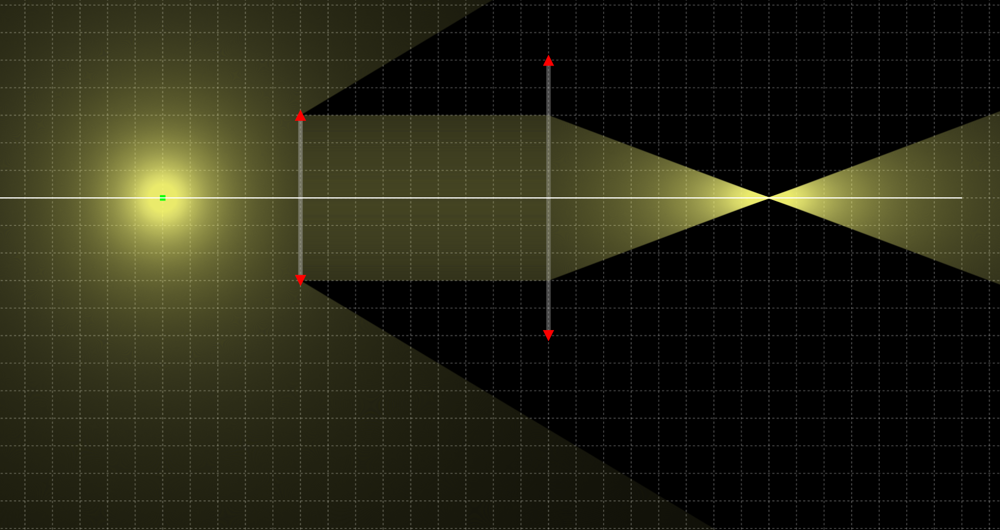
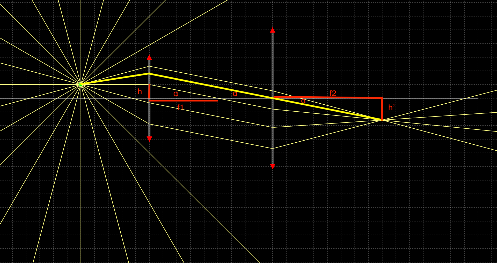

# Calculate magnification ratio

Ever since I picked up photography as a hobby, I realized I'm [just totally a shopper](https://www.youtube.com/watch?v=wQsR78SB3DM). I also realized I tend to enjoy taking photos close-up, which explains my fondness for telephoto lenses. Then I learned about macro. Obviously I tried some macro extension tubes, and in no time returned them for a Raynox DCR-250. I used to wonder how the magnification ratio is calculated using a Raynox, so I went and dug up some long-lost optics knowledge I learned in the 9th grade.

Obviously camera lenses are not ideal lenses, but let's assume they are. Let $f$ be the focal length, $d$ be the distance to the subject, and $d'$ be the distance of its image to the lens, then we have:

$$
\frac{1}{d} + \frac{1}{d'} = \frac{1}{f}
$$

If we place the object at the Raynox's focal point, then $d=f$, meaning $d'=1/0=\infty$. This means the light coming out of the lens is parallel. And if we place another lens right after it, it looks like the image comes from infinity. Practically, it's similar to looking at something very far away, like at a mountain afar. And since to the second lens, $d=\infty$, that means $d'=f$, or that the image is formed right at the focal point.

So to use the DCR-250, we simply attach it to the lens, set the lens to focus to infinity, and place the object of interest at the focal point of the DCR-250, then we'll get its image in focus, formed right at the sensor plane as we set the lens to focus to infinity. It's like that, at least theoretically.

We can visualize this using [a simulator tool like phydemo](https://phydemo.app/ray-optics/simulator/). Placing two lenses perpendicular to the line connecting their centers, then a light source right in front of the first one at its focal point too, we'll see that it converges at the focal point of the second lens.

To calculate the magnification ratio, let's move the light source up a bit to represent the head of a stick parallel to the lenses.

Assuming the height is $h$, the light ray coming out of the first lens is parallel. It's easy to see that the angle $\alpha$ between the light ray and the horizontal plane is:

$$
\tan(\alpha) = \frac{h}{f_1}
$$

Among this light beam, the ray crossing the center of the second lens will go straight through without any bending, merging with other rays at the image right on the focal plane at $f_2$. And since the ray is not bent, it's easy to see that we got the same angle $\alpha$ there:

$$
\tan(\alpha) = \frac{h'}{f_2}
$$

Therefore $\frac{h}{f_1}=\frac{h'}{f_2}$ and the magnification ratio is:

$$
\frac{h'}{h} = \frac{f_2}{f_1}
$$

The Raynox DCR-250 is 8 diopters. Using the [definition of diopters](https://universalphotonics.com/Content/refdocs/_upiRef11b.pdf), its focal length is then $f=\frac{1}{8} m=125 mm$. This means using the DCR-250 with:

- 125mm telelens, we get 1:1 macro
- 250mm telelens, we get 2:1 macro
- 300mm telelens, we get 2.4:1 macro

Now of course this is only calculated in the ideal scenario, and assumes that we set our base lens to focus to infinity. If not set to infinity, depending on the focusing distance, the distance between the lens and the Raynox, the distance to the object, and so on, we can get different magnification ratios.

I did run some test with the DCR-250 to see if we can get to 1:1 ratio using a 125mm base lens or 2:1 with a 250mm one, and if the image is really in focus if placing at ~125mm in front of the raynox, but that's for another post.