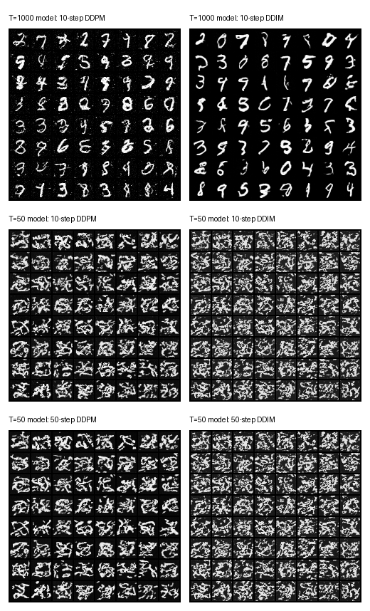
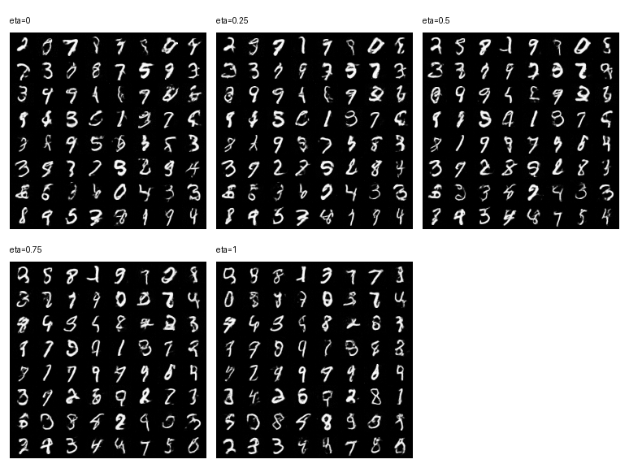
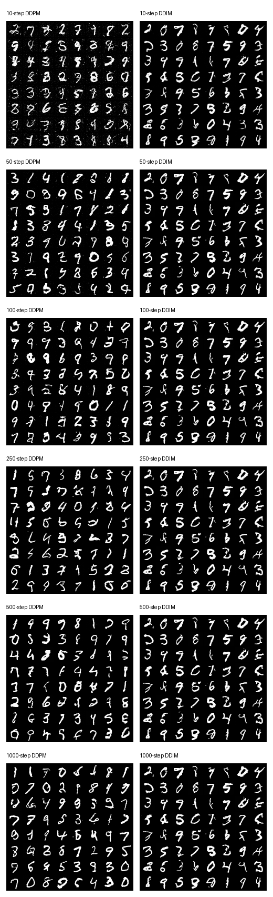
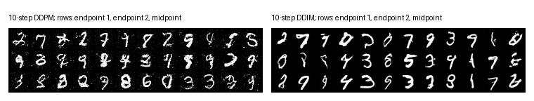

# Denoising Diffusion Implicit Models

This is my personal notes following the [DDIM paper](https://arxiv.org/pdf/2010.02502) and later on transcribed using chatGPT from screenshot of my note pages. There are a lot of mistakes but overall hopefully it still makes sense.

## DDPM Revisit

Recall that DDPM defines a forward diffusion process (forward noising).

$x$: original data

$$
z_i
=
\sqrt{1-\beta_i}\,z_{i-1}
+
\sqrt{\beta_i}\,\epsilon_i,
\qquad
\epsilon_i \sim \mathcal{N}(0,I)
$$

with $z_0=x$, $0<\beta_i<1$,

or that

$$
q(z_i|z_{i-1})
=
\mathcal{N}
\left(
z_i
\mid
\sqrt{1-\beta_i}\,z_{i-1},
\beta_i I
\right).
$$

We also showed that we can sample $z_t$ directly from $x$:

$$
q(z_t|x)
=
\mathcal{N}
\left(
z_t
\mid
\sqrt{\alpha_t}\,x,
(1-\alpha_t)I
\right)
$$

with

$$
\alpha_t
=
\prod_{\tau=1}^{t}
(1-\beta_\tau).
$$

With $T\gg$, $\alpha_t\rightarrow0$, so

$$
q(z_T|x)
=
q(z_T)
=
\mathcal{N}(z_T\mid0,I).
$$

What we actually want is the reverse process (denoising):

$$
q(z_{t-1}|z_t).
$$

We show that this too is a Gaussian with the same variance $\beta_t$ and some mean. Our model $\theta$ learns to approximate this reverse process:

$$
p(z_{t-1}|z_t,w)
=
\mathcal{N}
\left(
z_{t-1}
\mid
\mu(z_t,w,t),
\beta_t I
\right).
$$

We learn by maximizing the likelihood:

$$
p(x|w)
=
\int
p(x,z_1,\ldots,z_T|w)
\,dz_1\cdots dz_T
$$

or maximizing the log-likelihood

$$
\log p(x|w).
$$

We show that it has a lowerbound

$$
\log p(x|w)
\ge
L(w)
$$

and we learn to maximize this lowerbound which in turn increases

$$
\log p(x|w).
$$

The lower bound has a form:

$$
L(w)
=
-\sum_{t=2}^{T}
\mathbb{E}_{q(z_t|x)}
\left[
K_t(z_t,w)
\right]
+
\mathbb{E}_{q(z_1|x)}
\left[
\log p(x|z_1,w)
\right]
$$

where

$$
K_t(z_t,w)
=
\mathrm{KL}
\left(
q(z_{t-1}|z_t,x)
\;\|\;
p(z_{t-1}|z_t,w)
\right).
$$

Recall that we know $q(z_{t-1}|z_t)$ is also a Gaussian with variance $\beta_t$ with some mean and hence we try to learn $p$ to match $q$ with:

$$
p(z_{t-1}|z_t,w)
=
\mathcal{N}
\left(
z_{t-1}
\mid
\mu(z_t,w,t),
\beta_t I
\right).
$$

But here we're dealing with $q(z_{t-1}|z_t,x)$ which we can show to be:

$$
q(z_{t-1}|z_t,x)
=
\mathcal{N}
\left(
z_{t-1}
\mid
m(z_t,x),
\tilde{\beta}_t I
\right)
$$

with

$$
m(x,z_t)
=
\frac{
(1-\alpha_{t-1})\sqrt{1-\beta_t}\,z_t
+
\beta_t\sqrt{\alpha_{t-1}}\,x
}{
1-\alpha_t
}
$$

$$
\tilde{\beta}_t
=
\beta_t
\frac{1-\alpha_{t-1}}
{1-\alpha_t}.
$$

(as $t\uparrow$, $\beta_t\rightarrow0\rightarrow\tilde{\beta}_t^2\rightarrow\beta_t$)

So $K_t(z_t,w)$ is KL btw 2 Gaussians and:

$$
K_t(z_t,w)
=
\frac{1}{2\beta_t}
\left\|
m(x,z_t)
-
\mu(z_t,w,t)
\right\|^2
+
C.
$$

So we figure out the left term of $L(w)$. For the right term, we have:

$$
\log p(x|z_1,w)
=
-\frac{1}{2\beta_1}
\left\|
x
-
\mu(z_1,w,1)
\right\|^2
+
C.
$$

We can unify the 2 terms by predicting the noise $\epsilon_t$ instead.

We have:

$$
z_t
=
\sqrt{\alpha_t}\,x
+
\sqrt{1-\alpha_t}\,\epsilon_t,
\qquad
\epsilon_t
\sim
\mathcal{N}(0,I)
$$

$$
x
=
\frac{1}{\sqrt{\alpha_t}}\,z_t
-
\frac{\sqrt{1-\alpha_t}}{\sqrt{\alpha_t}}\,
\epsilon_t.
$$

Plug this into the equation of $m(x,z_t)$ we have:

$$
m(x,z_t)
=
\frac{1}{\sqrt{1-\beta_t}}
\left(
z_t
-
\frac{\beta_t}{\sqrt{1-\alpha_t}}
\epsilon_t
\right)
$$

This means instead of predicting the mean $\mu(z_t,w,t)$ of $p$ to match that $m(x,z_t)$ of $q$, we can predict the noise $\epsilon_t$ by $g(z_t,w,t)$, then:

$$
\mu(z_t,w,t)
=
\frac{1}{\sqrt{1-\beta_t}}
\left(
z_t
-
\frac{\beta_t}{\sqrt{1-\alpha_t}}
g(z_t,w,t)
\right)
$$

Plug the new equations for $m(x,z_t)$ and $\mu(z_t,w,t)$ to $K_t$, we have:

$$
K_t(z_t,w)
=
\frac{\beta_t}
{2(1-\beta_t)(1-\alpha_t)}
\left\|
g(z_t,w,t)
-
\epsilon_t
\right\|^2
+
C
$$

And since

$$
z_1
=
\sqrt{\alpha_1}\,x
+
\sqrt{1-\alpha_1}\,\epsilon_1,
\qquad
\epsilon_1
\sim
\mathcal{N}(0,I)
$$

$$
x
=
\frac{z_1-\sqrt{1-\alpha_1}\,\epsilon_1}
{\sqrt{\alpha_1}}
=
\frac{z_1-\sqrt{\beta_1}\,\epsilon_1}
{\sqrt{1-\beta_1}}
$$

and

$$
\mu(z_1,w,1)
=
\frac{1}{\sqrt{1-\beta_1}}
\left(
z_1
-
\sqrt{\beta_1}\,
g(z_1,w,1)
\right)
$$

So:

$$
\log p(x|z_1,w)
=
-\frac{1}{2(1-\beta_1)}
\left\|
g(z_1,w,1)
-
\epsilon_1
\right\|^2
+
C
$$

We can see that we can combine the left and right terms of $L(w)$ into one:

$$
L(w)
=
-J(w)
$$

with:

$$
J(w)
=
\sum_{t=1}^{T}
\mathbb{E}_{q(z_t|x)}
\left[
\frac{\beta_t}
{2(1-\beta_t)(1-\alpha_t)}
\left\|
g(z_t,w,t)
-
\epsilon_t
\right\|^2
\right]
$$

$$
\arg\max L(w)
=
\arg\min J(w)
$$

So training becomes:

1. Sample noise $\epsilon_t$.

2. Sample

$$
z_t
=
\sqrt{\alpha_t}\,x
+
\sqrt{1-\alpha_t}\,\epsilon_t
$$

3. Predict noise $g(z_t,w,t)$.

4. Minimize

$$
\left\|
g(z_t,w,t)
-
\epsilon_t
\right\|^2.
$$

And for denoising, we go from $T\rightarrow0$. We start from

$$
z_T
\sim
\mathcal{N}(0,I).
$$

At any time step $t$, we have $z_t$ and want to start from there to get $z_{t-1}$. To do so we need $q(z_{t-1}|z_t)$, which we know to have variance $\beta_t$ and its mean is predicted by the network $p$:

$$
\text{mean}
=
\mu(z_t,w,t)
=
\frac{1}{\sqrt{1-\beta_t}}
\left\{
z_t
-
\frac{\beta_t}{\sqrt{1-\alpha_t}}
g(z_t,w,t)
\right\}.
$$

Then

$$
z_{t-1}
=
\mu(z_t,w,t)
+
\sqrt{\beta_t}\,\epsilon,
\qquad
\epsilon
\sim
\mathcal{N}(0,I).
$$

Finally,

$$
x
=
\frac{1}{\sqrt{1-\beta_1}}
\left(
z_1
-
\frac{\beta_1}{\sqrt{1-\alpha_1}}
g(z_1,w,1)
\right).
$$

## DDIM

DDIM paper wants to improve over DDPM, specifically to remove the need to denoise from $T\rightarrow0$.

The reason we need to go step by step from $T\rightarrow0$ is because the forward process is Markovian. If we can find a different framework that avoids this characteristic, we might be able to denoise with less steps.

One key observation is the loss $J(w)$ depends on the marginal $q(z_t|x)$ only. They propose a new framework which eventually also depends only on $q(z_t|x)$. Interestingly, they propose to steer from the backward process instead. Starting with data $x$, we sample the final $z_T$:

$$
q(z_T|x)
=
\mathcal{N}
\left(
\sqrt{\alpha_T}\,x,
(1-\alpha_T)I
\right)
$$

(and of course, similar to DDPM, with $T\gg$, $z_T\sim\mathcal{N}(0,I)$)

Now with fixed $x$ and $z_T$, we "denoise":

$$
q(z_{t-1}|z_t,x)
=
\mathcal{N}
\left(
\sqrt{\alpha_{t-1}}\,x
+
\sqrt{1-\alpha_{t-1}-\sigma_t^2}
\cdot
\frac{z_t-\sqrt{\alpha_t}x}
{\sqrt{1-\alpha_t}},
\;
\sigma_t^2 I
\right)
$$

Under this framework, we will have:

$$
q(z_t|x)
=
\mathcal{N}
\left(
\sqrt{\alpha_t}\,x,
(1-\alpha_t)I
\right)
$$

Indeed, we can prove this via induction.

Base case: $t=T$ is true by definition.

Assume it's true for $t$, we need to prove it true for $t-1$, that is:

$$
q(z_{t-1}|x)
=
\mathcal{N}
\left(
z_{t-1}
\mid
\sqrt{\alpha_{t-1}}\,x,
(1-\alpha_{t-1})I
\right)
$$

We have:

$$
z_t
=
\sqrt{\alpha_t}\,x
+
\sqrt{1-\alpha_t}\,\epsilon,
\qquad
\epsilon\sim\mathcal{N}(0,I)
$$

From the definition of $q(z_{t-1}|z_t,x)$, we have:

$$
z_{t-1}
=
\sqrt{\alpha_{t-1}}\,x
+
\sqrt{1-\alpha_{t-1}-\sigma_t^2}
\cdot
\frac{z_t-\sqrt{\alpha_t}x}
{\sqrt{1-\alpha_t}}
+
\sigma_t\epsilon',
\qquad
\epsilon'\sim\mathcal{N}(0,I)
$$

$$
z_{t-1}
=
\sqrt{\alpha_{t-1}}\,x
+
\sqrt{1-\alpha_{t-1}-\sigma_t^2}
\frac{
\sqrt{\alpha_t}\,x+\sqrt{1-\alpha_t}\,\epsilon-\sqrt{\alpha_t}\,x
}{
\sqrt{1-\alpha_t}
}
+
\sigma_t\epsilon'
$$

$$
z_{t-1}
=
\sqrt{\alpha_{t-1}}\,x
+
\sqrt{1-\alpha_{t-1}-\sigma_t^2}\,\epsilon
+
\sigma_t\epsilon'
$$

The first term is fixed, $\epsilon$ and $\epsilon'$ are Gaussian and independent, so easy to see $z_{t-1}$ is also Gaussian with

$$
\mathbb{E}[z_{t-1}]
=
\sqrt{\alpha_{t-1}}\,x
$$

$$
\mathrm{Var}[z_{t-1}]
=
1-\alpha_{t-1}-\sigma_t^2+\sigma_t^2
=
1-\alpha_{t-1}
$$

$$
q(z_{t-1}|x)
=
\mathcal{N}
\left(
z_{t-1}
\mid
\sqrt{\alpha_{t-1}}\,x,
(1-\alpha_{t-1})
\right)
$$

So DDIM has the same marginal $q(z_t|x)$ as DDPM.

The forward process is then:

$$
q(z_t|z_{t-1},x)
=
\frac{
q(z_{t-1}|z_t,x)\,q(z_t|x)
}{
q(z_{t-1}|x)
}
$$

This forward process is no longer Markovian as it depends on both $x_{t-1}$ and $x$. The paper also mentions this forward $q(z_t|z_{t-1},x)$ is also Gaussian but it's not important.

This is true as we shall see later that by defining the backward process already, we can already denoise (once trained), without any knowledge of the forward.

That is we start with $z_T\sim\mathcal{N}(0,I)$ and denoise using $q(z_{t-1}|z_t,x)$. We need $x$ to do so, we can predict it by using

$$
z_t
=
\sqrt{\alpha_t}\,x
+
\sqrt{1-\alpha_t}\,\epsilon_t,
\qquad
\epsilon_t\sim\mathcal{N}(0,I)
$$

$$
x
\approx
f_\theta(z_t)
=
\frac{
z_t-\sqrt{1-\alpha_t}\,\epsilon_t
}{
\sqrt{\alpha_t}
}
$$

As before we use a network to predict the noise:

$$
\epsilon_t
\approx
g(z_t,w,t)
$$

So

$$
x
\approx
\frac{
z_t-\sqrt{1-\alpha_t}\,g(z_t,w,t)
}{
\sqrt{\alpha_t}
}
=
f(z_t,w,t)
$$

The generative process is then:

$$
p(z_{t-1}\mid z_t,w)
=
\begin{cases}
\mathcal{N}(f(z_1,w,0),\sigma_1^2I), & \text{if } t=1,\\
q(z_{t-1}\mid z_t,f(z_t,w,t)), & \text{otherwise.}
\end{cases}
$$

We use Gaussian for $t=1$ so generative process is supported everywhere.

Using the same derivation as DDPM, we get the ELBO:

$$
L(w)
=
-\sum_{t=2}^{T}
\mathbb{E}_{q(z_t|x)}
\left[
K_t(z_t,w)
\right]
+
\mathbb{E}_{q(z_1|x)}
\left[
\log p(x|z_1,w)
\right]
$$

We have:

$$
\log p(x|z_1,w)
=
-\frac{1}{2\sigma_1^2}
\left\|
x-f(z_1,w,0)
\right\|^2
+
C
$$

$$
=
-\frac{1}{2\sigma_1^2}
\left\|
x-
\frac{
z_1-\sqrt{1-\alpha_1}\,g(z_1,w,1)
}{
\sqrt{\alpha_1}
}
\right\|^2
+
C
$$

Since

$$
z_1
=
\sqrt{\alpha_1}\,x
+
\sqrt{1-\alpha_1}\,\epsilon_1,
\qquad
\epsilon_1
\sim
\mathcal{N}(0,I)
$$

$$
\log p(x|z_1,w)
=
-\frac{1}{2\sigma_1^2}
\left\|
x
-
\frac{
\sqrt{\alpha_1}x+\sqrt{1-\alpha_1}\epsilon_1-\sqrt{1-\alpha_1}\,g(z_1,w,1)
}{
\sqrt{\alpha_1}
}
\right\|^2
+
C
$$

$$
=
-\frac{1-\alpha_1}
{2\sigma_1^2\alpha_1}
\left\|
\epsilon_1
-
g(z_1,w,1)
\right\|^2
+
C
$$

Now for $K_t(z_t,w)$:

$$
K_t(z_t,w)
=
\mathrm{KL}
\left(
q(z_{t-1}|z_t,x)
\;\|\;
p(z_{t-1}|z_t,w)
\right)
$$

$$
=
\mathrm{KL}
\left(
q(z_{t-1}|z_t,x)
\;\|\;
q(z_{t-1}|z_t,f(z_t,w,t))
\right)
$$

(KL of 2 Gaussians)

$$
=
\frac{1}{2\sigma_t^2}
\left\|
\sqrt{\alpha_{t-1}}\,x
+
\sqrt{1-\alpha_{t-1}-\sigma_t^2}
\frac{z_t-\sqrt{\alpha_t}x}{\sqrt{1-\alpha_t}}
-
\sqrt{\alpha_{t-1}}\,f(z_t,w,t)
-
\sqrt{1-\alpha_{t-1}-\sigma_t^2}
\frac{z_t-\sqrt{\alpha_t}f(z_t,w,t)}{\sqrt{1-\alpha_t}}
\right\|^2
+
C
$$

We have

$$
z_t
=
\sqrt{\alpha_t}\,x
+
\sqrt{1-\alpha_t}\,\epsilon_t,
\qquad
\epsilon_t
\sim
\mathcal{N}(0,I)
$$

$$
z_t
=
\sqrt{\alpha_t}\,f(z_t,w,t)
+
\sqrt{1-\alpha_t}\,g(z_t,w,t)
$$

$$
K_t(z_t,w)
=
\frac{1}{2\sigma_t^2}
\left\|
\sqrt{\alpha_{t-1}}\,x
+
\sqrt{1-\alpha_{t-1}-\sigma_t^2}\,
\sqrt{1-\alpha_t}\,\epsilon_t
-
\frac{\sqrt{\alpha_{t-1}}}{\sqrt{\alpha_t}}
\left(
z_t
-
\sqrt{1-\alpha_t}\,g(z_t,w,t)
\right)
-
\sqrt{1-\alpha_{t-1}-\sigma_t^2}\,
\sqrt{1-\alpha_t}\,
g(z_t,w,t)
\right\|^2
+
C
$$

$$
=
\frac{1}{2\sigma_t^2}
\left\|
\sqrt{\frac{\alpha_{t-1}}{\alpha_t}}
\left(
\sqrt{\alpha_t}\,x
-
z_t
+
\sqrt{1-\alpha_t}\,g
\right)
+
\sqrt{(1-\alpha_t)(1-\alpha_{t-1}-\sigma_t^2)}
\left(
\epsilon_t-g
\right)
\right\|^2
+
C
$$

$$
=
\frac{1}{2\sigma_t^2}
\left\|
\sqrt{\frac{\alpha_{t-1}}{\alpha_t}}
\left(
-\sqrt{1-\alpha_t}\,\epsilon_t
+
\sqrt{1-\alpha_t}\,g
\right)
+
\sqrt{(1-\alpha_t)(1-\alpha_{t-1}-\sigma_t^2)}
(\epsilon_t-g)
\right\|^2
+
C
$$

$$
=
\frac{A}
{2\sigma_t^2\alpha_t}
\left\|
\epsilon_t
-
g(z_t,w,t)
\right\|^2
+
C
$$

So now putting this and the derivation for $\log p(x|z_1,w)$ back to $L(w)$, we can see that maximizing $L(w)$ equals to minimizing:

$$
J_{\text{DDIM}}(w)
=
\sum_{t=1}^{T}
\mathbb{E}_{q(z_t|x)}
\left[
\gamma_t
\left\|
g(z_t,w,t)
-
\epsilon_t
\right\|^2
\right]
$$

This is the same form as DDPM:

$$
J_{\text{DDPM}}(w)
=
\sum_{t=1}^{T}
\mathbb{E}_{q(z_t|x)}
\left[
\frac{\beta_t}
{2(1-\beta_t)(1-\alpha_t)}
\left\|
g(z_t,w,t)
-
\epsilon_t
\right\|^2
\right]
$$

(Here's how I understand next.)

If parameters are not shared, the global optimum is independent of $\gamma_t$, meaning we might as well set $\gamma_t=1$, which is the case for DDPM training. And when $\gamma_t=1$, the training objectives for both DDPM and DDIM are the same.

In practice, if the model is large enough, it can learn different parameters for different time step. I guess that's why we can use the same network for all time step and achieve good performance.

## Accelerated Sampling

Everything so far is only to show that using the same DDPM learning objective, we can train various models with different inference process as long as it leads to and depends on only the same marginals $q(z_t|x)$.

DDIM proposes another process that can generate using only a subset of steps.

Consider the subsequence $\tau$ of $[1,\ldots,T]$ of length $S$ with $\tau_S=T$, and let $\bar{\tau}=\{1,\ldots,T\}\setminus\tau$.

Define the backward:

$$
q_{\sigma,\tau}(z_t|x)
=
\mathcal{N}
\left(
\sqrt{\alpha_t}\,x,\,
(1-\alpha_t)I
\right),
\qquad
\forall t\in\bar{\tau}\cup\{1\}.
$$

The process for $t\in[S]$ is the same as DDIM's we've discussed so far, while for the $t\in\bar{\tau}$, they are sampled directly from $x$ using:

$$
q(z_t|x)
=
\mathcal{N}
\left(
\sqrt{\alpha_t}\,x,\,
(1-\alpha_t)I
\right).
$$

This way the inference process can be factorized as:

$$
q_{\sigma,\tau}(z_{1:T}|x)
=
q_{\sigma,\tau}(z_{\tau_S}|x)
\prod_{i=1}^{S}
q_{\sigma,\tau}(z_{\tau_{i-1}}|z_{\tau_i},x)
\prod_{t\in\bar{\tau}}
q_{\sigma,\tau}(z_t|x)
$$

And the generative process is:

$$
p(z_{1:T},x|w)
=
p(z_T)
\prod_{i=1}^{S}
p(z_{\tau_{i-1}}|z_{\tau_i})
\prod_{t\in\bar{\tau}}
p(x|z_t)
$$

or equivalently,

$$
p(z_{1:T},x|w)
=
p(z_T)
\prod_{i=1}^{S}
p(z_{\tau_{i-1}}|z_{\tau_i})
\prod_{t\in\bar{\tau}}
p(x|z_t).
$$

By doing the same derivation for $L(w)$, we'll again obtain the same training objective function. The role of the "skipped" steps is there to make the loss match, but we don't use them for generation.

Let's look at the update sampling rules.

### DDPM

$$
z_{t-1}
=
\frac{1}{\sqrt{1-\beta_t}}
\left(
z_t
-
\frac{\beta_t}{\sqrt{1-\alpha_t}}
g(z_t,t)
\right)
+
\sqrt{\beta_t}\,\epsilon,
\qquad
\epsilon\sim\mathcal N(0,I)
$$

### DDIM

$$
z_{t-1}
=
\sqrt{\alpha_{t-1}}
\left(
\frac{
z_t-\sqrt{1-\alpha_t}\,g(z_t,t)
}{
\sqrt{\alpha_t}
}
\right)
+
\sqrt{1-\alpha_{t-1}-\sigma_t^2}\,
g(z_t,t)
+
\sigma_t\epsilon,
\qquad
\epsilon\sim\mathcal N(0,I)
$$

DDIM defines

$$
\sigma_t
=
\eta
\sqrt{\frac{1-\alpha_{t-1}}{1-\alpha_t}}
\sqrt{1-\frac{\alpha_t}{\alpha_{t-1}}}
=
\eta
\sqrt{
\frac{1-\alpha_{t-1}}{1-\alpha_t}
\beta_t
}.
$$

When doing accelerated sampling, we replace $\alpha_t$ with $\alpha_{\tau}$.

When doing the full $T$ steps and $\eta=1$,

$$
\sigma_t^2
=
\frac{1-\alpha_{t-1}}{1-\alpha_t}\beta_t.
$$

When $\eta=0$, DDIM is deterministic (no $\epsilon$).

When $\eta>0$, the update rule looks more like DDPM.

## Thoughts
The paper goes on to compare the performance of DDIM vs DDPM. A few key results:
- DDIM performs very well with much less number of sampling steps, like 10x less.
- DDPM with full $T$ sampling steps still performs the best, but DDIM is very close
- With $\eta=\sigma=0$, DDIM becomes deterministic as the only noise added is the predicted noise, no random noise.
- Deterministic DDIM is consistent. With the same $z_T$, using different trajectories, i.e. different number of sampling steps, we get very similar images. This suggests $z_T$ contains information latent encoding of the image.
- Due to above reason, we can performs interpolation rather easily with DDIM.
- DDIM has low reconstruction noise.

I'm not going to discuss the results of the papers in detail, for I cannot do a better job than it does. Rather I'd like to play around with this new sampling strategy. What's really intriguing to me is that DDPM training is proposed for 1 strategy, but turn out under the hood it already supports various different family of generative processes. For example in accelerated sampling, just training DDPM already supports various sampling schedules (i.e. different $\tau$).

The use of predicted $x$ of DDIM is also interesting. When first learning DDPM, I wonder why we can't go directly to $x$ because after all we're predicting the noise added to $x$ to get $z_t$. Well, of course we can't because it'll be very noisy. DDPM slowly denoises step by step. It also has to do so because that's how it is framed. For (deterministic) DDIM, the updating rule can be decomposed into 2 parts, one is "going towards the direction of (predicted) $x$", and the other is "still adding a bit of noise of $z_t$". The way I understand this is, we make a predict and commit to go there, but since we know it's very noisy so by adding back a bit of noise, it keeps around the area of $z_t$. This way we move step by step to a mode of the less noisy data. Not sure if that makes sense...

Now I'm just going to play around with a trained DDPM but with DDIM sampling.

## Code & Examples
I provide chatGPT with the updating rule for DDIM and ask it to add the implementation to an [existing DDPM one](https://github.com/leisaueha/simple_mnist_ddpm). Using a pretrained DDPM checkpoint, I run a few experiments.

### DDIM vs DDPM

Using a DDPM checkpoint trained with $T=1000$ steps, I run denoising using DDPM/DDIM for 10 steps (beacause 50 is more than enough for MNIST, DDPM's output looks good in that case). As we can see, DDPM's output is still quite noisy yet DDIM's looks good.

I was curious so I trained another checkpoint but for only $T=50$ steps. Obviously it's a difficult task to denoise from pure gaussian to image in 50 steps so both outputs are terrible.

### $\eta$
I was expecting to see worse results with high $\eta$ but overlook it looks good. This is mainly due to MNIST being a very easy task I think.

### Number of steps
Here we experiment with using different number of denoising steps for DDIM. I also include results for DDPM. Obviously, more denoising steps works better.

### Interpolation
My favorite part. Unfortunately I think it's hard to see the interpolation using MNIST. I'd like to think there's interpolation going on there. For example in the first column of DDIM, 2 and 0 interpolated results in something that looks like the original 2 but with a curve at the bottom that might come from 0? maybe, lol.

