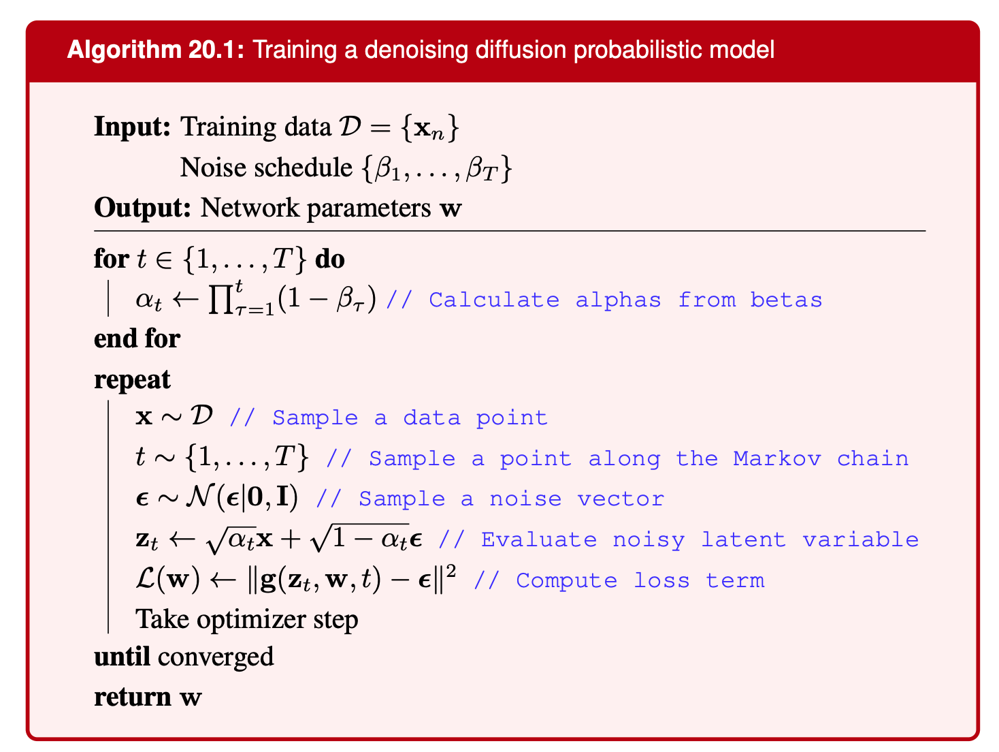
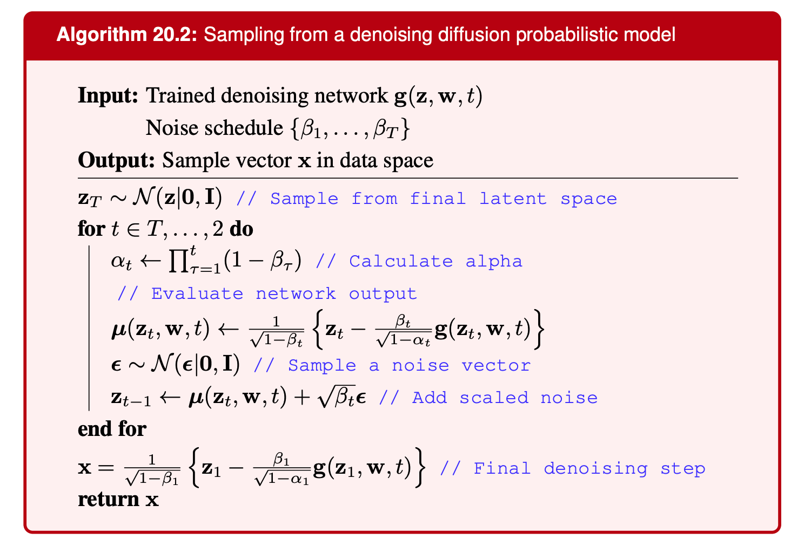
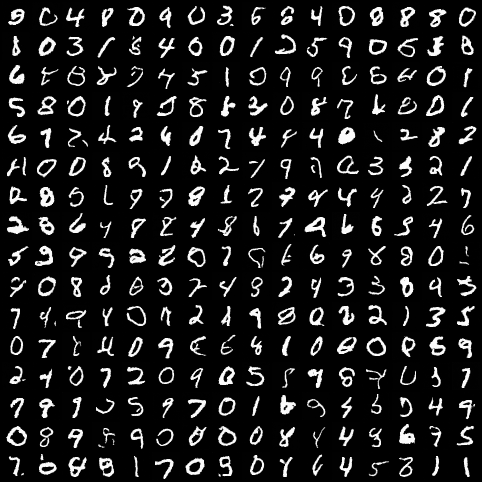

# How do Denoising Diffusion Probabilistic Models (DDPM) work?

There are two major approaches to diffusion:

- DDPM: we start from an image, gradually add Gaussian noise into it until it becomes total Gaussian noise and then learn to reverse this process (or learn the *denoising* process)
- Score-based: uses Langevin dynamics, SDEs, or ODEs to move samples from noise toward data

On the surface, the two approaches might look different, but after working out the maths they lead to the same model. Or so I heard, I've not dug deep into score-matching.

I was always fascinated by diffusion models. I remember back in grad school, I heard about so many generative models, but none worked so well. Not until GAN, but even GAN sounds so complicated and fragile to train. Or so I heard, I could be wrong, I was working on a different field.

Anyhoo, this post is simply my notes while working through chapter 20 of the book [**Deep Learning: Foundations & Concepts**](https://www.bishopbook.com/) by Bishop father and Bishop son. It's going to talk about the DDPM setup, and how we arrive at such a simple loss function. At the end, I asked chatGPT to help write a simple codebase to train a simple DDPM with MNIST. That's all, it won't have any later improvements such as DDIM, classifier guidance, classifier-free... It's my understanding of the materials, so it could be wrong somewhere. And I'll admit, there's going to be a lot of poorly used or plain terribly maths notation, but I hope it doesn't matter. Btw, all the latex equations were written with chatGPT's help. It was such a joy! I could simply send it a screenshot, or even type down an equation without worrying about the correctness, it'll just return perfectly formatted latex.

## The Forward Noising Process

### Basic Idea

The idea is to slowly add Gaussian noise to an image until the image is basically gone.

Then we train a model to undo that process. It starts from noise, removes a little bit of noise at each step, and hopefully ends up with an image.

For this to work, the noising process has to be simple and predictable. So we add standard normal noise using a fixed schedule. After enough steps, the original image becomes **pure standard Gaussian noise**.

  <iframe
    src="https://www.youtube.com/embed/imk6Xaf__N0"
    title="Video presentation"
    style="position: absolute; top: 0; left: 0; width: 100%; height: 100%;"
    frameborder="0"
    allow="accelerometer; autoplay; clipboard-write; encrypted-media; gyroscope; picture-in-picture; web-share"
    allowfullscreen>
  </iframe>

### One Noising Step

Let $x$ be the original data. In our case, think of it as an image.

Now define a chain of latent variables

$$
z_1, z_2, \ldots, z_T
$$

Each one is just the previous one with a bit more noise added.

The forward noising step is

$$
z_i = \sqrt{1-\beta_i}\,z_{i-1} + \sqrt{\beta_i}\,\epsilon_i,
\qquad
\epsilon_i \sim \mathcal{N}(0,I),
$$

where

$$
z_0 = x,
\qquad
0 < \beta_i < 1.
$$

To keep the notation shorter, let

$$
\alpha_i = 1-\beta_i,
\qquad
a_i = \sqrt{\alpha_i},
\qquad
b_i = \sqrt{\beta_i}.
$$

Then we can write the same forward step as

$$
z_i = a_i z_{i-1} + b_i \epsilon_i.
$$

### Why It Becomes Gaussian Noise

Now let's check why $z_T$ turns into $\mathcal{N}(0,I)$ (standard Gaussian) when $T$ is large.

Starting with $z_0=x$, the first step gives

$$
z_1 = a_1 x + b_1 \epsilon_1.
$$

The next step is

$$
z_2 = a_2 z_1 + b_2 \epsilon_2.
$$

Plug in $z_1$:

$$
z_2
=
a_2
\left(
a_1 x + b_1 \epsilon_1
\right)
+
b_2 \epsilon_2.
$$

So

$$
z_2
=
a_1 a_2 x
+
b_1 a_2 \epsilon_1
+
b_2 \epsilon_2.
$$

Doing the same thing one more time,

$$
z_3
=
a_1 a_2 a_3 x
+
b_1 a_2 a_3 \epsilon_1
+
b_2 a_3 \epsilon_2
+
b_3 \epsilon_3.
$$

After $T$ steps, this expands to

$$
z_T
=
\left(
\prod_{i=1}^{T} a_i
\right)x
+
\sum_{i=1}^{T}
\left(
b_i
\prod_{j=i+1}^{T} a_j
\right)
\epsilon_i.
$$

Because $0 < a_i < 1$, the product $\prod_{i=1}^{T} a_i$ goes to zero. So as $T$ gets large, the part containing the original image fades away.

The rest is just a weighted sum of Gaussian noise terms. That means the final $z_T$ is also Gaussian. Now we only need to check its mean and variance.

The noise terms are independent and each one has zero mean, so

$$
\mathbb{E}[z_T] \rightarrow 0.
$$

The original-image term disappears, so the variance comes from the noise sum:

$$
\mathrm{Var}(z_T)
=
\mathrm{Var}
\left[
\sum_{i=1}^{T}
\left(
b_i
\prod_{j=i+1}^{T} a_j
\right)
\epsilon_i
\right].
$$

Since the noises are independent,

$$
\mathrm{Var}(z_T)
=
\sum_{i=1}^{T}
\left(
b_i
\prod_{j=i+1}^{T} a_j
\right)^2
\mathrm{Var}(\epsilon_i).
$$

And since $\epsilon_i \sim \mathcal{N}(0,I)$,

$$
\mathrm{Var}(\epsilon_i)=I.
$$

Using $b_i = \sqrt{\beta_i}$ and $a_j = \sqrt{\alpha_j}$, we can simplify the scalar part of the variance:

$$
\mathrm{Var}(z_T)
=
\sum_{i=1}^{T}
\beta_i
\prod_{j=i+1}^{T}
\alpha_j.
$$

Because $\beta_i = 1-\alpha_i$, this is also

$$
\mathrm{Var}(z_T)
=
\sum_{i=1}^{T}
(1-\alpha_i)
\prod_{j=i+1}^{T}
\alpha_j.
$$

For small values of $T$, the pattern is clear:

$$
\mathrm{Var}(z_1)
=
1-\alpha_1,
$$

$$
\mathrm{Var}(z_2)
=
(1-\alpha_1)\alpha_2 + (1-\alpha_2)
=
1-\alpha_1\alpha_2,
$$

$$
\mathrm{Var}(z_3)
=
1-\alpha_1\alpha_2\alpha_3.
$$

So in general,

$$
\mathrm{Var}(z_T)
=
1 - \prod_{i=1}^{T} \alpha_i.
$$

As $T$ gets large, this approaches $I$ because $0 \lt \alpha_i \lt 1$.

So we have $z_T$ is a Gaussian with mean $0$ and variance $I$, so it's a standard Gaussian:

$$
z_T \sim \mathcal{N}(0,I).
$$

This is the reason sampling can start from plain Gaussian noise.

$$
z_T \sim \mathcal{N}(0,I)
\quad
\longrightarrow
\quad
z_{T-1}
\quad
\longrightarrow
\quad
\cdots
\quad
\longrightarrow
\quad
z_0 = x.
$$

### Forward Process As A Markov Chain

The one-step forward transition is

$$
q(z_t \mid z_{t-1})
=
\mathcal{N}
\left(
z_t
\mid
\sqrt{1-\beta_t}\,z_{t-1},
\beta_t I
\right).
$$

Because $z_t$ only looks at $z_{t-1}$, this is a Markov chain.

So the probability of the whole path factors into one-step transitions:

$$
q(z_1, z_2, \ldots, z_t \mid x)
=
q(z_1 \mid x)
\prod_{\tau=2}^{t}
q(z_{\tau} \mid z_{\tau-1}).
$$

Since $z_0=x$, we can also write it as

$$
q(z_1, z_2, \ldots, z_t \mid x)
=
\prod_{\tau=1}^{t}
q(z_{\tau} \mid z_{\tau-1}).
$$

### Sampling Any Noisy Step Directly

What we really want is a way to jump directly from $x$ to any $z_t$. To get that, integrate out the intermediate variables:

$$
q(z_t \mid x)
=
\int
q(z_1, z_2, \ldots, z_t \mid x)
\, dz_1 \cdots dz_{t-1}.
$$

Using the Markov-chain factorization:

$$
q(z_t \mid x)
=
\int
\prod_{\tau=1}^{t}
q(z_{\tau} \mid z_{\tau-1})
\, dz_1 \cdots dz_{t-1}.
$$

Now define

$$
\alpha_t
=
\prod_{\tau=1}^{t}
(1-\beta_{\tau}).
$$

Then the marginal distribution has this nice closed form:

$$
q(z_t \mid x)
=
\mathcal{N}
\left(
z_t
\mid
\sqrt{\alpha_t}\,x,
(1-\alpha_t)I
\right).
$$

This is the **diffusion kernel**. It is useful because it lets us sample $z_t$ directly from $x$ without simulating every earlier step.

We can prove it by induction. The $t=1$ case is immediate. Now assume that after $t-1$ steps,

$$
q(z_{t-1}\mid x)
=
\mathcal{N}
\left(
z_{t-1}
\mid
\sqrt{\alpha_{t-1}}x,
(1-\alpha_{t-1})I
\right).
$$

The next noising step is

$$
z_t
=
\sqrt{1-\beta_t}\,z_{t-1}
+
\sqrt{\beta_t}\,\epsilon_t,
\qquad
\epsilon_t \sim \mathcal{N}(0,I).
$$

Substitute the expression for $z_{t-1}$:

$$
z_t
=
\sqrt{1-\beta_t}
\left(
\sqrt{\alpha_{t-1}}x
+
\sqrt{1-\alpha_{t-1}}\,\epsilon_{t-1}
\right)
+
\sqrt{\beta_t}\,\epsilon_t.
$$

Then

$$
z_t
=
\sqrt{(1-\beta_t)\alpha_{t-1}}\,x
+
\sqrt{(1-\beta_t)(1-\alpha_{t-1})}\,\epsilon_{t-1}
+
\sqrt{\beta_t}\,\epsilon_t.
$$

With $x$ fixed, the first term is just a constant. The other two terms are a weighted sum of Gaussian noises, so $z_t$ is Gaussian as well.

The noise terms have zero mean, so

$$
\mathbb{E}[z_t] = \sqrt{\alpha_t}x.
$$

Here we used $\alpha_t = \prod_{\tau=1}^{t}(1-\beta_{\tau}) = (1-\beta_t)\alpha_{t-1}$.

The constant term contributes no variance. The remaining two independent Gaussian terms give

$$
(1-\beta_t)(1-\alpha_{t-1}) + \beta_t
=
1-(1-\beta_t)\alpha_{t-1}
=
1 -\alpha_t.
$$

So

$$
q(z_t\mid x)
=
\mathcal{N}
\left(
z_t
\mid
\sqrt{\alpha_t}x,
(1-\alpha_t)I
\right).
$$

Equivalently, we can sample it using

$$
z_t
=
\sqrt{\alpha_t}x
+
\sqrt{1-\alpha_t}\epsilon,
\qquad
\epsilon\sim\mathcal{N}(0,I).
$$

For large enough $T$, $\alpha_T \approx 0$, so

$$
q(z_T \mid x)
\approx
q(z_T)
=
\mathcal{N}(z_T \mid 0, I).
$$

So the last latent variable is approximately standard Gaussian noise.

Now the real question is how to go backward:

$$
q(z_{t-1} \mid z_t).
$$

We will approximate that reverse distribution using a neural network:

$$
p(z_{t-1} \mid z_t, w)
\approx
q(z_{t-1} \mid z_t).
$$

## The Reverse Denoising Process

  <iframe
    src="https://www.youtube.com/embed/r9Rsl9fSFfw"
    title="Video presentation"
    style="position: absolute; top: 0; left: 0; width: 100%; height: 100%;"
    frameborder="0"
    allow="accelerometer; autoplay; clipboard-write; encrypted-media; gyroscope; picture-in-picture; web-share"
    allowfullscreen>
  </iframe>

### The Reverse Step We Want

The forward direction is easy because we chose it:

$$
q(z_t \mid z_{t-1})
=
\mathcal{N}
\left(
z_t
\mid
\sqrt{1-\beta_t}\,z_{t-1},
\beta_t I
\right).
$$

For generation, we need the opposite direction:

$$
q(z_{t-1}\mid z_t).
$$

Bayes' theorem says

$$
q(z_{t-1}\mid z_t)
=
\frac{
q(z_t\mid z_{t-1})q(z_{t-1})
}{
q(z_t)
}.
$$

The problem is that this is not something we can compute directly. The terms $q(z_{t-1})$ and $q(z_t)$ depend on the data distribution, which is exactly the thing we do not know.

Strümke and Langseth (2023), citing Feller (1949), point out that if the step size is infinitesimal, the reverse process has the same kind of distributional form as the forward process.

So we use that as motivation and approximate each reverse step with a Gaussian.

Instead of trying to compute

$$
q(z_{t-1}\mid z_t),
$$

we learn a model for it:

$$
p(z_{t-1}\mid z_t,w)
\approx
q(z_{t-1}\mid z_t).
$$

The model is parameterized as

$$
p(z_{t-1}\mid z_t,w)
=
\mathcal{N}
\left(
z_{t-1}
\mid
\mu(z_t,w,t),
\beta_t I
\right).
$$

Here

$$
\mu(z_t,w,t)
$$

is the mean predicted by a neural network. The variance is fixed to the same $\beta_t$ schedule.

### Why The Reverse Step Is Gaussian

Now let's derive why this Gaussian shape makes sense.

Start with the reverse transition again:

$$
q(z_{t-1}\mid z_t).
$$

By Bayes' theorem,

$$
q(z_{t-1}\mid z_t)
=
\frac{
q(z_t\mid z_{t-1})q(z_{t-1})
}{
q(z_t)
}.
$$

Take the log:

$$
\log q(z_{t-1}\mid z_t)
=
\log q(z_t\mid z_{t-1})
+
\log q(z_{t-1})
-
\log q(z_t).
$$

Inside this conditional distribution, $z_t$ is fixed, so $\log q(z_t)$ can be absorbed into a constant:

$$
\log q(z_{t-1}\mid z_t)
=
\log q(z_t\mid z_{t-1})
+
\log q(z_{t-1})
+
C.
$$

Now define

$$
r = z_{t-1}-z_t,
\qquad
z_{t-1}=z_t+r.
$$

Recall the forward kernel:

$$
q(z_t\mid z_{t-1})
=
\mathcal{N}
\left(
z_t
\mid
a_t z_{t-1},
\beta_t I
\right),
\qquad
a_t=\sqrt{1-\beta_t}.
$$

So its log-density is

$$
\log q(z_t\mid z_{t-1})
=
-\frac{1}{2\beta_t}
\left\|
z_t-a_tz_{t-1}
\right\|^2
+
C.
$$

Using $z_{t-1}=z_t+r$:

$$
z_t-a_tz_{t-1}
=
z_t-a_t(z_t+r)
=
(1-a_t)z_t-a_t r.
$$

Substitute that into the quadratic term. Anything that only depends on $z_t$ goes into the constant:

$$
\log q(z_t\mid z_{t-1})
=
-\frac{a_t^2}{2\beta_t}\|r\|^2
+
\frac{a_t(1-a_t)}{\beta_t}z_t^T r
+
C.
$$

Now use the Taylor expansion of a real function $f(x)$ around $a$:

$$
f(x)
=
f(a)
+
f'(a)(x-a)
+
\frac{f''(a)}{2}(x-a)^2
+
\cdots
$$

For our case, use

$$
r = z_{t-1}-z_t,
\qquad
z_{t-1}=z_t+r.
$$

So

$$
\log q(z_{t-1})
=
\log q(z_t+r).
$$

Apply the multivariate Taylor expansion around $z_t$:

$$
\log q(z_t+r)
\approx
\log q(z_t)
+
r^T S(z_t)
+
\frac{1}{2}r^T H(z_t)r,
$$

with

$$
S(z_t)=\nabla_{z_t}\log q(z_t),
\qquad
H(z_t)=\nabla^2_{z_t}\log q(z_t).
$$

Combining the forward likelihood term and this Taylor approximation gives

$$
\log q(z_{t-1}\mid z_t)
=
-\frac{1}{2}
r^T
\left(
\frac{a_t^2}{\beta_t}I-H(z_t)
\right)
r
+
r^T
\left[
S(z_t)
+
\frac{a_t(1-a_t)}{\beta_t}z_t
\right]
+
C.
$$

Also,

$$
\frac{a_t^2}{\beta_t}
=
\frac{1-\beta_t}{\beta_t}
=
\frac{1}{\beta_t}-1.
$$

When $\beta_t$ is tiny, $\frac{1}{\beta_t}$ is huge, so the leftover $-1-H(z_t)$ part is small compared with it.

So we approximate the log reverse transition as

$$
\log q(z_{t-1}\mid z_t)
\approx
-\frac{1}{2\beta_t}r^T r
+
r^T
\left[
S(z_t)
+
\frac{a_t(1-a_t)}{\beta_t}z_t
\right]
+
C.
$$

Let

$$
m_t
=
S(z_t)
+
\frac{a_t(1-a_t)}{\beta_t}z_t.
$$

Now put $r = z_{t-1}-z_t$ back in:

$$
\log q(z_{t-1}\mid z_t)
\approx
-\frac{1}{2\beta_t}
(z_{t-1}-z_t)^T
(z_{t-1}-z_t)
+
(z_{t-1}-z_t)^T m_t
+
C.
$$

Expand the quadratic:

$$
(z_{t-1}-z_t)^T(z_{t-1}-z_t)
=
z_{t-1}^Tz_{t-1}
-
2z_t^Tz_{t-1}
+
z_t^Tz_t.
$$

Now keep only the terms that depend on $z_{t-1}$:

$$
\log q(z_{t-1}\mid z_t)
\approx
-\frac{1}{2\beta_t}
z_{t-1}^Tz_{t-1}
+
z_{t-1}^T
\left(
\frac{1}{\beta_t}z_t+m_t
\right)
+
C.
$$

A Gaussian log-density can be written as

$$
\log p(z)
=
-\frac{1}{2}
z^T\Sigma^{-1}z
+
z^T\Sigma^{-1}\mu
+
C.
$$

Comparing coefficients, we get

$$
\Sigma^{-1}
=
\frac{1}{\beta_t}I.
$$

which means

$$
\Sigma
=
\beta_t I.
$$

So the reverse transition is Gaussian-shaped, with variance $\beta_t I$ and some mean.

We let a neural network learn that mean:

$$
p(z_{t-1}\mid z_t,w)
=
\mathcal{N}
\left(
z_{t-1}
\mid
\mu(z_t,w,t),
\beta_t I
\right).
$$

So the forward process is

$$
x \rightarrow z_1 \rightarrow \cdots \rightarrow z_T,
\qquad
z_T \sim \mathcal{N}(0,I).
$$

and generation tries to run it backward:

$$
z_T \rightarrow z_{T-1} \rightarrow \cdots \rightarrow z_1 \rightarrow x.
$$

When $\beta_t$ is small, this backward step can be approximated as

$$
p(z_{t-1}\mid z_t,w)
=
\mathcal{N}
\left(
z_{t-1}
\mid
\mu(z_t,w,t),
\beta_t I
\right).
$$

The variance is fixed, and the neural network learns the mean.

## Evidence Lower Bound

### The Learnable Reverse Trajectory

So far, the reverse transition is approximated by a Gaussian:

$$
q(z_{t-1}\mid z_t)
\approx
\mathcal{N}
\left(
z_{t-1}
\mid
\mu_t,
\beta_t I
\right).
$$

and the mean comes from a neural network:

$$
p(z_{t-1}\mid z_t,w)
=
\mathcal{N}
\left(
z_{t-1}
\mid
\mu(z_t,w,t),
\beta_t I
\right).
$$

The true reverse trajectory can be written like this:

$$
q(x,z_1,\ldots,z_T)
=
q(z_T)
\prod_{t=2}^{T}
q(z_{t-1}\mid z_t)
q(x\mid z_1).
$$

We replace it with a learnable model:

$$
p(x,z_1,\ldots,z_T\mid w)
=
p(z_T)
\prod_{t=2}^{T}
p(z_{t-1}\mid z_t,w)
p(x\mid z_1,w),
$$

where

$$
p(z_T)=\mathcal{N}(z_T\mid 0,I).
$$

### Why We Need The ELBO

Ideally, we would choose $w$ by maximizing the likelihood of the data:

$$
p(x\mid w)
=
\int
p(x,z_1,\ldots,z_T\mid w)
\,dz_1\cdots dz_T.
$$

Equivalently, maximize

$$
\log p(x\mid w).
$$

But this is hard to compute directly, because we would need to integrate over every possible trajectories:

$$
z_1,z_2,\ldots,z_T.
$$

Instead, we'll show that this likelihood has a tractable lower bound ELBO:

$$
\log p(x\mid w)
\geq
\mathrm{ELBO}.
$$

And if so, instead of maximizing $\log p(x\mid w)$ directly, we can maximize the lower bound. As the lower bound goes it, [it raises the likelihood up](https://www.youtube.com/watch?v=fELtsnzGM9g&list=RDfELtsnzGM9g&start_radio=1).

Let $z = z_{1:T}$. The identity we want is

$$
\ln p(x\mid w)
=
\mathcal{L}(w)
+
\mathrm{KL}
\left(
q(z)
\;\|\;
p(z\mid x,w)
\right)
$$

where

$$
\mathcal{L}(w)
=
\int
q(z)
\ln
\frac{
p(x,z\mid w)
}{
q(z)
}
\,dz,
$$

and

$$
\mathrm{KL}(f(z)\|g(z))
=
-
\int
f(z)
\ln
\frac{
g(z)
}{
f(z)
}
\,dz.
$$

Because $\mathrm{KL} \geq 0$,

$$
\ln p(x\mid w)
\geq
\mathcal{L}(w).
$$

So $\mathcal{L}(w)$ is the ELBO. But how do we get there?

### Deriving The ELBO Identity

Start with

$$
\ln p(x\mid w) = \int q(z)\ln p(x\mid w)\,dz,
$$

because $\int q(z)\,dz = 1$.

Use

$$
p(x\mid w)
=
\frac{p(x,z\mid w)}{p(z\mid x,w)},
$$

Then

$$
\ln p(x\mid w)
=
\int q(z)
\ln
\frac{
p(x,z\mid w)
}{
p(z\mid x,w)
}
\,dz.
$$

Now multiply and divide by $q(z)$ inside the log:

$$
\ln p(x\mid w)
=
\int q(z)
\ln
\left[
\frac{
p(x,z\mid w)
}{
q(z)
}
\frac{
q(z)
}{
p(z\mid x,w)
}
\right]
\,dz.
$$

Then split the log:

$$
\ln p(x\mid w)
=
\int q(z)
\ln
\frac{
p(x,z\mid w)
}{
q(z)
}
\,dz
+
\int q(z)
\ln
\frac{
q(z)
}{
p(z\mid x,w)
}
\,dz.
$$

So we get

$$
\ln p(x\mid w)
=
\mathcal{L}(w)
+
\mathrm{KL}
\left(
q(z)\|p(z\mid x,w)
\right).
$$

Now here's the coolest thing!!! This works for any choice of $q(z)$, which means we can choose $q(z)=q(z\mid x)$ which is the forward diffusion process we already defined!

Let's do that substitution then we'll have:

$$
\mathcal{L}(w)
=
\int q(z\mid x)
\ln
\frac{
p(x,z\mid w)
}{
q(z\mid x)
}
\,dz
=
\mathbb{E}_{q(z\mid x)}[A],
\qquad
A
=
\ln
\frac{
p(x,z\mid w)
}{
q(z\mid x)
}.
$$

The reverse generative model factors as

$$
p(x,z\mid w)
=
p(z_T)
\prod_{t=2}^{T}
p(z_{t-1}\mid z_t,w)
p(x\mid z_1,w).
$$

The forward process factors as

$$
q(z\mid x)
=
q(z_1\mid x)
\prod_{t=2}^{T}
q(z_t\mid z_{t-1},x).
$$

So

$$
A
=
\ln
\frac{
p(z_T)
\prod_{t=2}^{T}
p(z_{t-1}\mid z_t,w)
p(x\mid z_1,w)
}{
q(z_1\mid x)
\prod_{t=2}^{T}
q(z_t\mid z_{t-1},x)
}.
$$

Expand the log:

$$
\begin{aligned}
A
=&\;
\ln p(z_T)
+
\sum_{t=2}^{T}
\ln p(z_{t-1}\mid z_t,w)
+
\ln p(x\mid z_1,w)
\\
&-
\ln q(z_1\mid x)
-
\sum_{t=2}^{T}
\ln q(z_t\mid z_{t-1},x).
\end{aligned}
$$

Rearrange it:

$$
A
=
\ln p(z_T)
+
\sum_{t=2}^{T}
\ln
\frac{
p(z_{t-1}\mid z_t,w)
}{
q(z_t\mid z_{t-1},x)
}
-
\ln q(z_1\mid x)
+
\ln p(x\mid z_1,w).
$$

The first term uses the fixed distribution $z_T \sim \mathcal{N}(z_T\mid0, I)$. The third term also does not depend on $w$. Since neither changes the trainable parameters, we can ignore them for optimization.

So for optimizing $w$, the part we care about is

$$
\sum_{t=2}^{T}
\ln
\frac{
p(z_{t-1}\mid z_t,w)
}{
q(z_t\mid z_{t-1},x)
}
+
\ln p(x\mid z_1,w).
$$

Now take expectation under the forward process $q(z\mid x)$:

$$
\mathbb{E}_{q(z\mid x)}
\left[
\sum_{t=2}^{T}
\ln
\frac{
p(z_{t-1}\mid z_t,w)
}{
q(z_t\mid z_{t-1},x)
}
+
\ln p(x\mid z_1,w)
\right].
$$

By linearity of expectation:

$$
\sum_{t=2}^{T}
\mathbb{E}_{q(z\mid x)}
\left[
\ln
\frac{
p(z_{t-1}\mid z_t,w)
}{
q(z_t\mid z_{t-1},x)
}
\right]
+
\mathbb{E}_{q(z\mid x)}
\left[
\ln p(x\mid z_1,w)
\right].
$$

### One Transition Term

Now look at one transition term:

$$
\mathbb{E}_{q(z\mid x)}
\left[
\ln
\frac{
p(z_{t-1}\mid z_t,w)
}{
q(z_t\mid z_{t-1},x)
}
\right].
$$

Define

$$
f(z_{t-1},z_t,w,x)
=
\ln
\frac{
p(z_{t-1}\mid z_t,w)
}{
q(z_t\mid z_{t-1},x)
}.
$$

Then

$$
\mathbb{E}_{q(z\mid x)}
\left[
f(z_{t-1},z_t,w,x)
\right]
=
\int
q(z_{1:T}\mid x)
f(z_{t-1},z_t,w,x)
\,dz_{1:T}.
$$

This is an integration over the whole trajectory $z_{1:T}$, but it's quite conspicuous that there might be away to rewrite it to depend only on $z_{t-1}$ and $z_t$. We'll do exactly that below.

Using the forward factorization,

$$
q(z_{1:T}\mid x)
=
q(z_1\mid x)
\prod_{\tau=2}^{T}
q(z_{\tau}\mid z_{\tau-1},x).
$$

Substitute the forward factorization:

$$
\int
q(z_1\mid x)
\prod_{\tau=2}^{T}
q(z_{\tau}\mid z_{\tau-1},x)
f(z_{t-1},z_t,w,x)
\,dz_{1:T}.
$$

The function $f$ only depends on $z_{t-1}$ and $z_t$.

So variables after $t$ can be integrated out one by one:

$$
\int q(z_T\mid z_{T-1},x)\,dz_T = 1,
$$

$$
\int q(z_{T-1}\mid z_{T-2},x)\,dz_{T-1} = 1,
$$

and so on, until only terms up to $z_t$ remain.

Therefore,

$$
=
\int
q(z_1\mid x)
\prod_{\tau=2}^{t}
q(z_{\tau}\mid z_{\tau-1},x)
f(z_{t-1},z_t,w,x)
\,dz_{1:t}.
$$

Next, we integrate out the earlier variables $z_1,\ldots,z_{t-2}$.

Recall the marginalization identity

$$
q(y\mid x)
=
\int
q(y,z\mid x)dz
=
\int
q(y\mid z,x)q(z\mid x)\,dz.
$$

Applying this to the forward chain,

$$
\int
q(z_2\mid z_1,x)q(z_1\mid x)\,dz_1
=
q(z_2\mid x).
$$

Then,

$$
\int
q(z_3\mid z_2,x)q(z_2\mid x)\,dz_2
=
q(z_3\mid x).
$$

Repeating this up to $t-1$, we get

$$
\begin{aligned}
&\int
q(z_1\mid x)
\prod_{\tau=2}^{t}
q(z_{\tau}\mid z_{\tau-1},x)
f(z_{t-1},z_t,w,x)
\,dz_1\cdots dz_t
\\
&=
\int
q(z_{t-1}\mid x)
q(z_t\mid z_{t-1},x)
f(z_{t-1},z_t,w,x)
\,dz_{t-1}dz_t.
\end{aligned}
$$

Putting $f$ back in, one transition term becomes

$$
\int
q(z_{t-1}\mid x)
q(z_t\mid z_{t-1},x)
\ln
\frac{
p(z_{t-1}\mid z_t,w)
}{
q(z_t\mid z_{t-1},x)
}
\,dz_{t-1}dz_t.
$$

Indeed, we've remove all other steps in the trajectory except for $t$ and $t-1$. Let's continue.

The numerator is the learned reverse step:

$$
p(z_{t-1}\mid z_t,w).
$$

The denominator is still the forward step:

$$
q(z_t\mid z_{t-1},x).
$$

But what we want is a comparison between

$$
p(z_{t-1}\mid z_t,w)
\quad \text{with} \quad
q(z_{t-1}\mid z_t,x).
$$

So let's reverse that $q$!!! We have:

$$
q(z_{t-1}\mid x)q(z_t\mid z_{t-1},x)
=
q(z_t\mid x)q(z_{t-1}\mid z_t,x)
=
q(z_{t-1},z_t\mid x).
$$

Therefore,

$$
q(z_t\mid z_{t-1},x)
=
\frac{
q(z_t\mid x)q(z_{t-1}\mid z_t,x)
}{
q(z_{t-1}\mid x)
}.
$$

Substitute this into the log:

$$
\ln
\frac{
p(z_{t-1}\mid z_t,w)
}{
q(z_t\mid z_{t-1},x)
}
=
\ln
\frac{
p(z_{t-1}\mid z_t,w)q(z_{t-1}\mid x)
}{
q(z_t\mid x)q(z_{t-1}\mid z_t,x)
}.
$$

Split the log:

$$
\ln
\frac{
p(z_{t-1}\mid z_t,w)q(z_{t-1}\mid x)
}{
q(z_t\mid x)q(z_{t-1}\mid z_t,x)
}
=
\ln
\frac{
p(z_{t-1}\mid z_t,w)
}{
q(z_{t-1}\mid z_t,x)
}
+
\ln
\frac{
q(z_{t-1}\mid x)
}{
q(z_t\mid x)
}.
$$

The first term contains the model. The second term does not depend on $w$, so it becomes part of the constant.

Dropping the $w$-independent parts, the transition term is

$$
\int
q(z_t\mid x)
q(z_{t-1}\mid z_t,x)
\ln
\frac{
p(z_{t-1}\mid z_t,w)
}{
q(z_{t-1}\mid z_t,x)
}
\,dz_{t-1}dz_t
+
C.
$$

The inner part is the negative of a KL divergence:

$$
-
\mathrm{KL}
\left(
q(z_{t-1}\mid z_t,x)
\|
p(z_{t-1}\mid z_t,w)
\right).
$$

So this transition contributes

$$
-
\mathbb{E}_{q(z_t\mid x)}
\left[
\mathrm{KL}
\left(
q(z_{t-1}\mid z_t,x)
\|
p(z_{t-1}\mid z_t,w)
\right)
\right]
+
C.
$$

Maximizing this is the same as minimizing

$$
\mathbb{E}_{q(z_t\mid x)}
\left[
\mathrm{KL}
\left(
q(z_{t-1}\mid z_t,x)
\|
p(z_{t-1}\mid z_t,w)
\right)
\right].
$$

Now the ELBO can be written as

$$
\mathcal{L}(w)
=
-
\sum_{t=2}^{T}
\mathbb{E}_{q(z_t\mid x)}
\left[
K_t(z_t,w)
\right]
+
\mathbb{E}_{q(z_1\mid x)}
\left[
\ln p(x\mid z_1,w)
\right],
$$

where

$$
K_t(z_t,w)
=
\mathrm{KL}
\left(
q(z_{t-1}\mid z_t,x)
\|
p(z_{t-1}\mid z_t,w)
\right).
$$

The first term is the **consistency term**. It makes the learned reverse transition match the true reverse transition.

The second term is the **reconstruction term**. It makes the last denoising step recover $x$ from $z_1$.

For reconstruction, use

$$
p(x\mid z_1,w)
=
\mathcal{N}
\left(
x
\mid
\mu(z_1,w,1),
\beta_1 I
\right).
$$

During training, sample $z_1\sim q(z_1\mid x)$, predict $\mu(z_1,w,1)$, and compute

$$
\ln p(x\mid z_1,w)
=
-\frac{1}{2\beta_1}
\left\|
x-\mu(z_1,w,1)
\right\|^2
+
C.
$$

### The Consistency Term

Now focus on the consistency term.

Take one of them:

$$
K_t(z_t,w)
=
\mathrm{KL}
\left(
q(z_{t-1}\mid z_t,x)
\|
p(z_{t-1}\mid z_t,w)
\right).
$$

We already made $p$ Gaussian. Now we show that $q$ is also Gaussian and has a closed form. Then $K_t$ becomes KL between two Gaussians.

Use Bayes again:

$$
q(z_{t-1}\mid z_t,x)
=
\frac{
q(z_t\mid z_{t-1},x)q(z_{t-1}\mid x)
}{
q(z_t\mid x)
}.
$$

By the Markov property,

$$
q(z_t\mid z_{t-1},x)
=
q(z_t\mid z_{t-1}).
$$

so

$$
q(z_{t-1}\mid z_t,x)
=
\frac{
q(z_t\mid z_{t-1})
q(z_{t-1}\mid x)
}{
q(z_t\mid x)
}.
$$

The forward transition is

$$
q(z_t\mid z_{t-1})
=
\mathcal{N}
\left(
z_t
\mid
\sqrt{1-\beta_t}\,z_{t-1},
\beta_t I
\right).
$$

Also,

$$
q(z_{t-1}\mid x)
=
\mathcal{N}
\left(
z_{t-1}
\mid
\sqrt{\alpha_{t-1}}x,
(1-\alpha_{t-1})I
\right).
$$

Since $q(z_t\mid x)$ does not depend on $z_{t-1}$, it is constant when we view this as a distribution over $z_{t-1}$.

Therefore,

$$
q(z_{t-1}\mid z_t,x)
=
C
\exp
\left(
-\frac{
\left\|
z_t-\sqrt{1-\beta_t}\,z_{t-1}
\right\|^2
}{
2\beta_t
}
-
\frac{
\left\|
z_{t-1}-\sqrt{\alpha_{t-1}}x
\right\|^2
}{
2(1-\alpha_{t-1})
}
\right).
$$

So $q(z_{t-1}\mid z_t,x)$ is proportional to a product of Gaussian-looking terms. Expanding the exponent and collecting terms in $z_{t-1}$ gives

$$
q(z_{t-1}\mid z_t,x)
=
\mathcal{N}
\left(
z_{t-1}
\mid
m_t(x,z_t),
\sigma_t^2 I
\right),
$$

where

$$
m_t(x,z_t)
=
\frac{
(1-\alpha_{t-1})\sqrt{1-\beta_t}\,z_t
+
\beta_t\sqrt{\alpha_{t-1}}x
}{
1-\alpha_t
},
$$

and

$$
\sigma_t^2
=
\frac{
\beta_t(1-\alpha_{t-1})
}{
1-\alpha_t
}.
$$

The learned reverse model is

$$
p(z_{t-1}\mid z_t,w)
=
\mathcal{N}
\left(
z_{t-1}
\mid
\mu_t(z_t,w,t),
\beta_t I
\right).
$$

So the consistency term is

$$
K_t(z_t,w)
=
D_{\mathrm{KL}}
\left(
\mathcal{N}
\left(
m_t(x,z_t),
\sigma_t^2 I
\right)
\;\|\;
\mathcal{N}
\left(
\mu_t(z_t,w,t),
\beta_t I
\right)
\right).
$$

### KL Between Two Gaussians

Assume we have two Gaussians over the same variable $x$:

$$
q(x)=\mathcal{N}(x\mid \mu_q,\sigma_q^2),
\qquad
p(x)=\mathcal{N}(x\mid \mu_p,\sigma_p^2).
$$

The KL divergence is

$$
D_{\mathrm{KL}}(q\|p)
=
\int q(x)\ln \frac{q(x)}{p(x)}dx.
$$

Equivalently,

$$
D_{\mathrm{KL}}(q\|p)
=
\mathbb{E}_q[\ln q(x)]
-
\mathbb{E}_q[\ln p(x)].
$$

Recall the Gaussian log-density:

$$
\ln p(x)
=
C_1
-
\ln\sigma_p
-
\frac{1}{2\sigma_p^2}(x-\mu_p)^2,
$$

and

$$
\ln q(x)
=
C_2
-
\ln\sigma_q
-
\frac{1}{2\sigma_q^2}(x-\mu_q)^2.
$$

Substitute the two log-densities:

$$
\begin{aligned}
D_{\mathrm{KL}}(q\|p)
&=
\mathbb{E}_q
\left[
C_1-\ln\sigma_q
-
\frac{1}{2\sigma_q^2}(x-\mu_q)^2
\right]
\\
&\quad
-
\mathbb{E}_q
\left[
C_2-\ln\sigma_p
-
\frac{1}{2\sigma_p^2}(x-\mu_p)^2
\right].
\end{aligned}
$$

For learning $\mu_p$, only this term depends on $\mu_p$:

$$
\frac{1}{2\sigma_p^2}
\mathbb{E}_q
\left[
(x-\mu_p)^2
\right].
$$

Therefore,

$$
D_{\mathrm{KL}}(q\|p)
=
\frac{1}{2\sigma_p^2}
\mathbb{E}_q
\left[
(x-\mu_p)^2
\right]
+
C.
$$

Now rewrite

$$
x-\mu_p
=
x-\mu_q+\mu_q-\mu_p.
$$

Thus,

$$
(x-\mu_p)^2
=
\left[
(x-\mu_q)+(\mu_q-\mu_p)
\right]^2.
$$

Expanding,

$$
\begin{aligned}
(x-\mu_p)^2
&=
(x-\mu_q)^2
+
2(x-\mu_q)(\mu_q-\mu_p)
+
(\mu_q-\mu_p)^2.
\end{aligned}
$$

Take expectation under $q$:

$$
\mathbb{E}_q[(x-\mu_p)^2]
=
\mathbb{E}_q[(x-\mu_q)^2]
+
2(\mu_q-\mu_p)\mathbb{E}_q[x-\mu_q]
+
(\mu_q-\mu_p)^2.
$$

But

$$
\mathbb{E}_q[(x-\mu_q)^2]
=
\sigma_q^2,
$$

and

$$
\mathbb{E}_q[x-\mu_q]
=
0.
$$

Therefore,

$$
\mathbb{E}_q[(x-\mu_p)^2]
=
\sigma_q^2
+
(\mu_q-\mu_p)^2.
$$

So

$$
D_{\mathrm{KL}}(q\|p)
=
\frac{1}{2\sigma_p^2}
(\mu_q-\mu_p)^2
+
C.
$$

### Matching Gaussian Means

When the variances are fixed, learning through Gaussian KL turns into matching the means:

$$
K_t(z_t,w)
=
\frac{1}{2\beta_t}
\left\|
m_t(x,z_t)
-
\mu_t(z_t,w,t)
\right\|^2
+
C.
$$

So, up to constants and weights, this term is

$$
K_t(z_t,w)
\propto
\left\|
m_t(x,z_t)
-
\mu_t(z_t,w,t)
\right\|^2.
$$

To compute $K_t(z_t,w)$, sample $z_t \sim q(z_t\mid x)$ and calculate the true posterior mean

$$
m_t(x,z_t)
=
\frac{
(1-\alpha_{t-1})\sqrt{1-\beta_t}\,z_t
+
\beta_t\sqrt{\alpha_{t-1}}x
}{
1-\alpha_t
}.
$$

The model gives its own reverse mean, $\mu_t(z_t,w,t)$.

So this loss compares

$$
m_t(x,z_t)
\quad
\text{and}
\quad
\mu_t(z_t,w,t).
$$

This already gives a valid objective. But there is a nicer way to parameterize it.

### Predicting Noise Instead Of The Mean

Recall

$$
z_t
=
\sqrt{\alpha_t}x
+
\sqrt{1-\alpha_t}\epsilon_t,
\qquad
\epsilon_t\sim\mathcal{N}(0,I).
$$

Rearrange it to solve for $x$:

$$
x
=
\frac{1}{\sqrt{\alpha_t}}z_t
-
\frac{\sqrt{1-\alpha_t}}{\sqrt{\alpha_t}}\epsilon_t.
$$

The true posterior mean was

$$
m_t(x,z_t)
=
\frac{
(1-\alpha_{t-1})\sqrt{1-\beta_t}\,z_t
+
\beta_t\sqrt{\alpha_{t-1}}x
}{
1-\alpha_t
}.
$$

Substitute the expression for $x$, use $\alpha_t=\alpha_{t-1}(1-\beta_t)$, and simplify:

$$
m_t(x,z_t)
=
\frac{1}{\sqrt{1-\beta_t}}
\left(
z_t
-
\frac{\beta_t}{\sqrt{1-\alpha_t}}\epsilon_t
\right).
$$

The neural network is supposed to learn the reverse mean

$$
\mu_t(z_t,w,t).
$$

But instead of asking it to predict the whole mean directly, we can build part of the structure into the formula.

Since the mean only depends on $z_t$, $w$, and $t$, define

$$
\mu_t(z_t,w,t)
=
\frac{1}{\sqrt{1-\beta_t}}
\left(
z_t
-
\frac{\beta_t}{\sqrt{1-\alpha_t}}
g(z_t,w,t)
\right).
$$

This is like keeping a fixed path through $z_t$ and only asking the network to predict $g(z_t,w,t)$.

In other words, instead of predicting the mean, the network predicts the noise.

The true posterior mean is

$$
m_t(x,z_t)
=
\frac{1}{\sqrt{1-\beta_t}}
\left(
z_t
-
\frac{\beta_t}{\sqrt{1-\alpha_t}}\epsilon_t
\right).
$$

The model mean is

$$
\mu_t(z_t,w,t)
=
\frac{1}{\sqrt{1-\beta_t}}
\left(
z_t
-
\frac{\beta_t}{\sqrt{1-\alpha_t}}g(z_t,w,t)
\right).
$$

Subtracting them gives

$$
m_t(x,z_t)-\mu_t(z_t,w,t)
=
\frac{\beta_t}{\sqrt{1-\beta_t}\sqrt{1-\alpha_t}}
\left[
g(z_t,w,t)-\epsilon_t
\right].
$$

The consistency term was

$$
K_t(z_t,w)
=
\frac{1}{2\beta_t}
\left\|
m_t(x,z_t)-\mu_t(z_t,w,t)
\right\|^2
+
C.
$$

Plugging the difference above into it gives

$$
K_t(z_t,w)
=
\frac{\beta_t}{2(1-\beta_t)(1-\alpha_t)}
\left\|
g(z_t,w,t)-\epsilon_t
\right\|^2
+
C.
$$

So training the reverse process is really training a network to predict the noise $\epsilon_t$.

### The Reconstruction Term

Now we can fold the reconstruction term into the same idea.

Start with the reconstruction term:

$$
\ln p(x\mid z_1,w)
=
-\frac{1}{2\beta_1}
\left\|
x-\mu(z_1,w,1)
\right\|^2
+
C.
$$

At $t=1$, the forward process is

$$
z_1
=
\sqrt{\alpha_1}x
+
\sqrt{1-\alpha_1}\epsilon_1,
\qquad
\epsilon_1\sim\mathcal{N}(0,I).
$$

Since

$$
\alpha_1=1-\beta_1,
$$

we get

$$
z_1
=
\sqrt{1-\beta_1}x
+
\sqrt{\beta_1}\epsilon_1.
$$

Solve for $x$:

$$
x
=
\frac{1}{\sqrt{1-\beta_1}}
\left(
z_1-\sqrt{\beta_1}\epsilon_1
\right).
$$

Use the same noise-prediction form for the model mean:

$$
\mu(z_1,w,1)
=
\frac{1}{\sqrt{1-\beta_1}}
\left(
z_1-\sqrt{\beta_1}g(z_1,w,1)
\right).
$$

Then

$$
\ln p(x\mid z_1,w)
=
-\frac{1}{2(1-\beta_1)}
\left\|
g(z_1,w,1)-\epsilon_1
\right\|^2
+
C.
$$

For $t\geq 2$, we had

$$
K_t(z_t,w)
=
\frac{\beta_t}{2(1-\beta_t)(1-\alpha_t)}
\left\|
g(z_t,w,t)-\epsilon_t
\right\|^2
+
C.
$$

For $t=1$, $\alpha_1=1-\beta_1$, so

$$
\frac{\beta_1}{2(1-\beta_1)(1-\alpha_1)}
=
\frac{\beta_1}{2(1-\beta_1)\beta_1}
=
\frac{1}{2(1-\beta_1)}.
$$

This is exactly the reconstruction term. So reconstruction is just the $t=1$ case of the same noise-prediction objective.

### The Full Noise-Prediction Objective

So the whole objective can be written with

$$
K_t(z_t,w)
=
\frac{\beta_t}{2(1-\beta_t)(1-\alpha_t)}
\left\|
g(z_t,w,t)-\epsilon_t
\right\|^2
$$

where

$$
z_t
=
\sqrt{\alpha_t}x
+
\sqrt{1-\alpha_t}\epsilon_t,
\qquad
\epsilon_t\sim\mathcal{N}(0,I).
$$

In this noising and denoising setup, training the diffusion model means maximizing the ELBO:

$$
\ln p(x\mid w)
\geq
\mathcal{L}(w).
$$

Equivalently, minimize the negative ELBO. After rewriting the consistency terms and the reconstruction term, the loss becomes

$$
\mathcal{J}(w)
=
\sum_{t=1}^{T}
\mathbb{E}_{q(z_t\mid x)}
\left[
\frac{\beta_t}{2(1-\beta_t)(1-\alpha_t)}
\left\|
g(z_t,w,t)-\epsilon_t
\right\|^2
\right]
$$

where

$$
z_t
=
\sqrt{\alpha_t}x
+
\sqrt{1-\alpha_t}\epsilon_t,
\qquad
\epsilon_t\sim\mathcal{N}(0,I).
$$

### The Simplified DDPM Loss

In practice, DDPMs usually drop the time-dependent weight $\frac{\beta_t}{2(1-\beta_t)(1-\alpha_t)}$. The simplified loss is

$$
\mathcal{J}_{\mathrm{simple}}(w)
=
\mathbb{E}_{t,x,\epsilon_t}
\left[
\left\|
g(z_t,w,t)-\epsilon_t
\right\|^2
\right]
$$

Here we sample $t\sim \mathrm{Uniform}\{1,\dots,T\}$ and $\epsilon_t\sim\mathcal{N}(0,I)$, then directly construct

$$
z_t
=
\sqrt{\alpha_t}x
+
\sqrt{1-\alpha_t}\epsilon_t.
$$

Then feed $z_t$ and $t$ into the neural network to get $g(z_t,w,t)$. The model learns to predict the exact noise that was added to $x$.

### Sampling

At inference time, start from Gaussian noise and denoise one step at a time:

$$
z_T \sim \mathcal{N}(0,I),
\qquad
z_T \rightarrow z_{T-1} \rightarrow \cdots \rightarrow z_1 \rightarrow x.
$$

Algoirthms (taken from Bishop's book).

## Code Example
Once we understood the maths behind, we see that training a (simple) DDPM is very simple (duh?). I didn't write this code, instead I asked chatGPT to write it for me. It's a very small and simple model, trained with the original DDPM algorithm on MNIST data. I trained using the default settings for 100 epochs and got some interesting results.

It's not the best, and I previously did get much better result training a larger model for a bit longer. But given I'm using my MBP with only 18GB RAM, it ran for 100 epochs at 22s/epoch and got this result, that's pretty sweet 🙃. You can find the code, the trained ckpt, and some generated samples [in this repo](https://github.com/leisaueha/simple_mnist_ddpm). Finally, here are some animation of the denoising process from that model:

  <iframe
    src="https://www.youtube.com/embed/93dLXAoizzo"
    title="Video presentation"
    style="position: absolute; top: 0; left: 0; width: 100%; height: 100%;"
    frameborder="0"
    allow="accelerometer; autoplay; clipboard-write; encrypted-media; gyroscope; picture-in-picture; web-share"
    allowfullscreen>
  </iframe>

## References

- Ho, J., Jain, A., & Abbeel, P. (2020). *Denoising Diffusion Probabilistic Models*. arXiv:2006.11239. https://arxiv.org/abs/2006.11239
- Feller, W. (1949). On the theory of stochastic processes, with particular reference to applications. In *Proceedings of the First Berkeley Symposium on Mathematical Statistics and Probability*, Vol. 1, pp. 403-433. University of California Press.
- Bishop, C. M., & Bishop, H. (2023). *Deep Learning: Foundations and Concepts*. Springer Nature.
- Strümke, I., & Langseth, H. (2023). *Lecture Notes in Probabilistic Diffusion Models*. arXiv:2312.10393.
