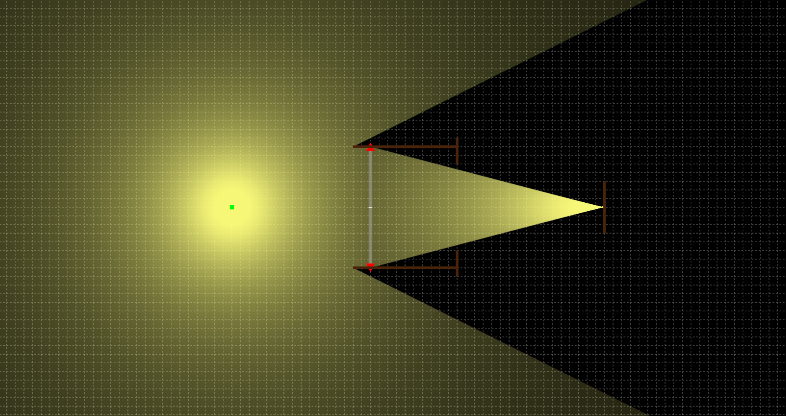
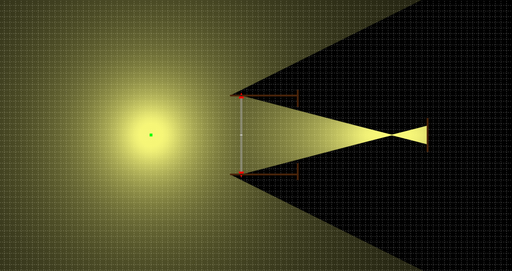
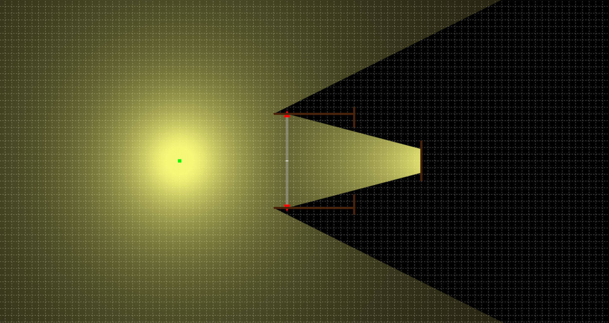
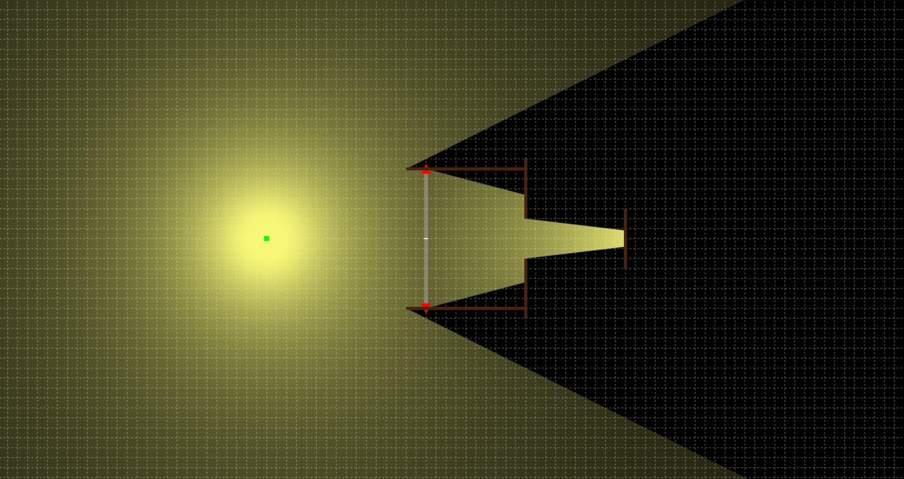
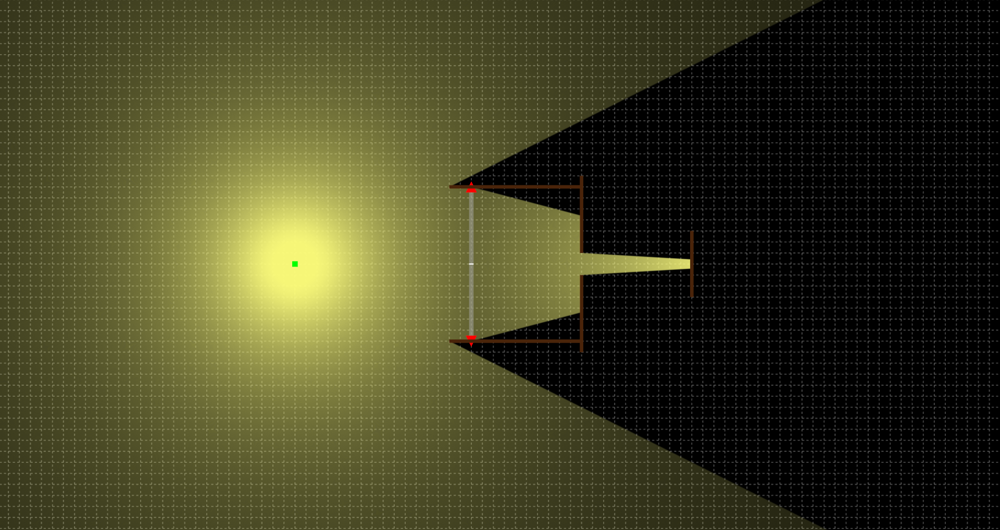

# How does aperture affect Depth of Field?

  <iframe
    src="https://www.youtube.com/embed/474oey9qCbI"
    title="Video presentation"
    style="position: absolute; top: 0; left: 0; width: 100%; height: 100%;"
    frameborder="0"
    allow="accelerometer; autoplay; clipboard-write; encrypted-media; gyroscope; picture-in-picture; web-share"
    allowfullscreen>
  </iframe>

Camera lenses aren't ideal lens, but for this discussion let's simplify things and assume they are. Let's use our favorite [simulator](https://phydemo.app/ray-optics/).

Here we have a point light source, a lens, (with lens body top/bottom), aperture (see it open to let light in?), and the rays focus at a point which happens to be right on the sensor.

In this scenario, the point light source has image perfectly "focused" on the sensor. But what if we change focus and hence moving the lens with relative to the sensor? It could look like below:

As we can see, now the point light source is projected on sensor as a circle not a point. To generalize, we can actually think a point source always projected on to sensor as a circle. If that circle is big, the image is blur, and the smaller it gets, the "sharper" the image is.

So how does aperture help? When we close down the aperture, fewer rays pass through the lens. This makes the cone of light narrower. A narrower cone makes a smaller blur circle on the sensor. So out-of-focus areas look sharper. That means more of the scene appears to be in focus. <mark>This is why a smaller aperture gives a deeper depth of field.</mark>

Of course, aperture is not the only thing that controls DOF. Here’s the equation from Wikipedia.
“for a given maximum acceptable circle of confusion diameter c, focal length f, f-number N, and distance to subject u.”

$$
DOF \approx \frac{2u^2NC}{f^2}
$$

As we can see while DOF is proportional to aperture (f-number N), it’s inversely proportional to the square of focal length f.
This is why long telephoto lenses can still produce very shallow depth of field and strong background blur, even at a relatively high f-number like f/4.

Also, here we assume the aperture is a circle. In real lenses, it may be more like a polygon. That shape affects the shape of the bokeh.

Let's see how it works with the 7Artisans 35mm F0.95.

  <iframe
    src="https://www.youtube.com/embed/dWcb17tqSsw"
    title="Video presentation"
    style="position: absolute; top: 0; left: 0; width: 100%; height: 100%;"
    frameborder="0"
    allow="accelerometer; autoplay; clipboard-write; encrypted-media; gyroscope; picture-in-picture; web-share"
    allowfullscreen>
  </iframe>

