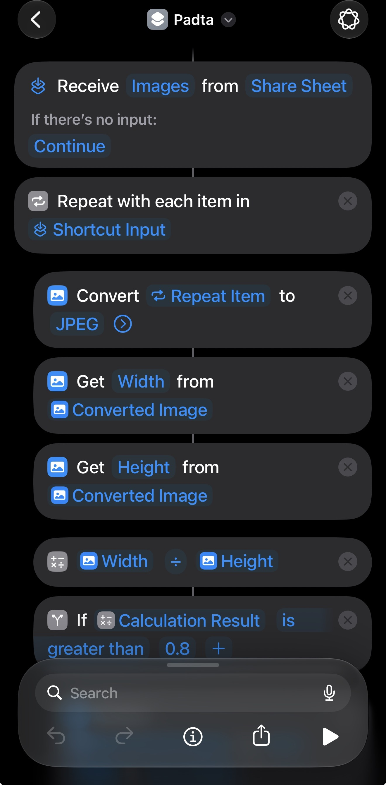
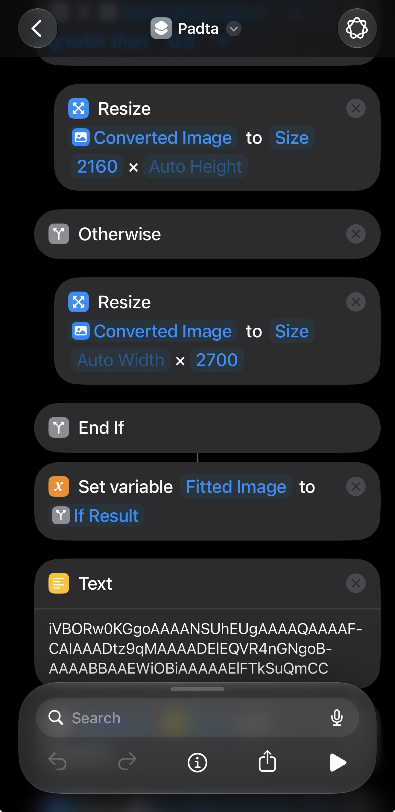
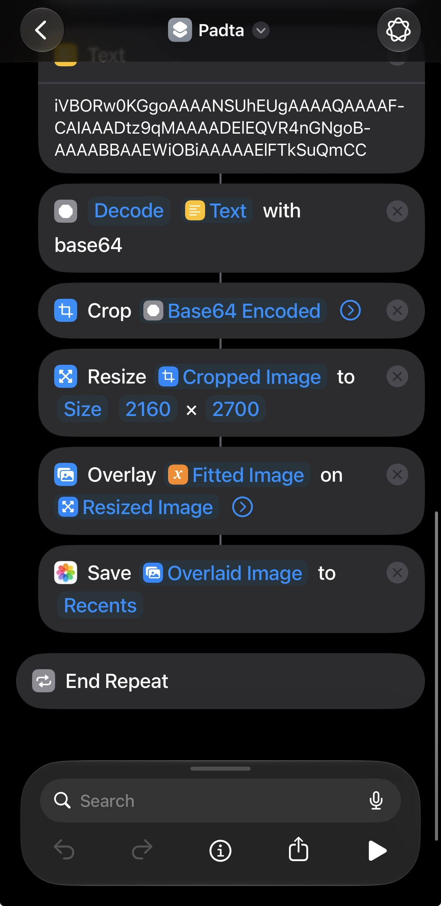

# Programmatically pad your photos for Instagram post

2026 and still don't automatically keep the original ratio across photos in a post. Sure, you can post 20 photos, but only from mobile, not desktop. Gotta have their own reason, and it definitely is stupid.

Anyhoos, I know you can use app, but I think most free apps such as lightroom mobile exports one at a time only? maybe, I don't know for sure, but here's another way. You can use python to automatically read and pad your photos one by one so they're ready for instagram posts.

## Desktop

First, create a conda env so you don't mess up your python env, then just `pip install numpy pillow`. Put your photos at the same dir as this script, run, and it'll generate new padded photos in an output directory, ready for posting.  I'm sure there's better way and sure there are ways to make it nicer, but this is a good beginning. This is a quick vibe-coded script using codex btw.


```python
from pathlib import Path
import random

import numpy as np
from PIL import Image, ImageOps, ImageFilter

from image_support import is_supported_image, open_image


def fit_inside(img: Image.Image, target_w: int, target_h: int) -> Image.Image:
    w, h = img.size
    scale = min(target_w / w, target_h / h)
    new_w = max(1, int(round(w * scale)))
    new_h = max(1, int(round(h * scale)))
    return img.resize((new_w, new_h), Image.LANCZOS)


def make_film_border(
    img: Image.Image,
    target_w: int,
    target_h: int,
    border_rgb=(10, 10, 9),   # slightly lifted black
    grain_std=7.0,
    warm_tint=(6, 4, 0),      # subtle warm tone in border
    edge_line=True,
) -> Image.Image:
    img = ImageOps.exif_transpose(img).convert("RGB")
    fitted = fit_inside(img, target_w, target_h)

    canvas = np.zeros((target_h, target_w, 3), dtype=np.float32)
    canvas[:] = np.array(border_rgb, dtype=np.float32)

    fw, fh = fitted.size
    x0 = (target_w - fw) // 2
    y0 = (target_h - fh) // 2

    fitted_np = np.asarray(fitted).astype(np.float32)
    canvas[y0:y0+fh, x0:x0+fw] = fitted_np

    # Border mask: 1 in border, 0 in image area
    border_mask = np.ones((target_h, target_w), dtype=np.float32)
    border_mask[y0:y0+fh, x0:x0+fw] = 0.0

    # Grain on border only
    noise = np.random.normal(0, grain_std, size=(target_h, target_w, 1)).astype(np.float32)
    canvas += noise * border_mask[..., None]

    # Low-frequency unevenness on border to mimic analog edge density
    lowfreq = np.random.normal(0, 1.0, size=(target_h, target_w)).astype(np.float32)
    lowfreq_img = Image.fromarray(np.clip((lowfreq - lowfreq.min()) / ((np.ptp(lowfreq) + 1e-6)) * 255, 0, 255).astype(np.uint8))
    lowfreq_img = lowfreq_img.filter(ImageFilter.GaussianBlur(radius=max(target_w, target_h) / 60))
    lowfreq = np.asarray(lowfreq_img).astype(np.float32)
    lowfreq = (lowfreq - 127.5) / 127.5
    canvas += (lowfreq[..., None] * 10.0) * border_mask[..., None]

    # Slight warm tint in border
    tint = np.array(warm_tint, dtype=np.float32)
    canvas += tint * border_mask[..., None] * 0.35

    # Thin inner line around image area
    if edge_line:
        line_val = 28 + random.randint(-6, 6)
        t = max(1, round(min(target_w, target_h) / 900))
        # top
        canvas[max(0, y0 - t):y0, x0:x0+fw] = line_val
        # bottom
        canvas[y0+fh:min(target_h, y0+fh+t), x0:x0+fw] = line_val
        # left
        canvas[y0:y0+fh, max(0, x0 - t):x0] = line_val
        # right
        canvas[y0:y0+fh, x0+fw:min(target_w, x0+fw+t)] = line_val

    out = np.clip(canvas, 0, 255).astype(np.uint8)
    return Image.fromarray(out, mode="RGB")


def main():
    in_dir = Path(".")
    out_dir = Path("./out")
    out_dir.mkdir(exist_ok=True)

    images = sorted(
        path for path in in_dir.iterdir()
        if path.is_file() and is_supported_image(path)
    )
    for path in images:
        with open_image(path) as img:
            w, h = img.size

            # Instagram-friendly target canvas:
            # portrait -> 4:5
            # landscape -> 1.91:1
            target_w, target_h = 2160, 2700

            result = make_film_border(img, target_w, target_h)
            out_path = out_dir / f"{path.stem}.jpg"
            result.save(
                out_path,
                format="JPEG",
                quality=100,
                subsampling=0,
            )

        print(f"saved {out_path}")


if __name__ == "__main__":
    main()
```

## Iphone
Better yet, we can do all this using ios' shortcut! This is all chatGPT (gosh it's good). After creating the shortcut, simply select photos, click Share -> scroll down to see the action (I named it Padta), then it'll run and you'll see the padded copies appearing in your photo library.

Note that text base64 text is: `iVBORw0KGgoAAAANSUhEUgAAAAQAAAAFCAIAAADtz9qMAAAADElEQVR4nGNgoBAAAABBAAEWiOBiAAAAAElFTkSuQmCC`. After decoded it becomes all an black png. Needless to say, you can tweak this to have white padding, or user can even select an input.

The algorithm is simple:

- we select multiple images
- for each:
    + convert to jpg. The reason for this is cropped image still contains original metadata. For example a landscape photo after cropped into portrait can still contain metadata indicating its original format and data, so when get width/height, it results in the wrong width/height. I use highest quality for conversion because jpg is lossy, but for instagram post it doesn't matter lol.
    + now we get width/height from the converted image.
    + We want to retrofit into 4:5 ratio, so we choose the frame of size 2160:2700. First we fit our photo into this frame. Depending on the ratio width/height (threshold = 0.8), we resize the height/width accordingly.
    + Now for the padding, we create a black photo of size 2160:2700. The base64 text above after decoded is an all black image.
    + now we have the resize photo, a black frame, we just overlay the former to the latter.
    + save resulted photo to library

Obviously there's a lot of room to improve. We can choose different color as well, and I think this can be done with user input. I wonder if adding curved corners is possible, but this is enough for me.



