# Moon Photo Stacking


## Overview
I recently learned stacking and editing moon photos. I am no expert, but just wanna note down my learning here in case it could be useful.

The general idea is this. You get caught between New York city and the Moon, yeah I know it's crazy, but it's true. The best you can do is to take out your longest focal length lens and shoot a few photos of [chị Hằng](https://en.wiktionary.org/wiki/ch%E1%BB%8B_H%E1%BA%B1ng). But since the Moon is so far away, we have to shoot it through a lot of atmosphere. Turbulence in the atmosphere makes the Moon shimmer, blur, and distort from one moment to the next. If you remember videos of the moon from a telescope, it's always undulating, that's the interference, see this example below:

<div style="position: relative; padding-bottom: 56.25%; height: 0; overflow: hidden;">
  <iframe
    src="https://www.youtube.com/embed/ybjUq3Meqb0"
    title="Video presentation"
    style="position: absolute; top: 0; left: 0; width: 100%; height: 100%;"
    frameborder="0"
    allow="accelerometer; autoplay; clipboard-write; encrypted-media; gyroscope; picture-in-picture; web-share"
    allowfullscreen>
  </iframe>
</div>

One way to deal with that is [Lucky Imaging](https://en.wikipedia.org/wiki/Lucky_imaging#Explanation). The idea is we take a lot of photos, then keep only the sharpest ones which happen to be taken during moments of relatively stable air. We align and stack these good frames together. Selecting the good frames helps us avoid atmospheric blur, while stacking reduces random noise and gives us a cleaner image which can tolerate more sharpening. Some simple math.

In an ideal case, each aligned image can be written as the same signal + independent random noise:

$$
X_i = S + \epsilon_i
$$

Average $N$ images:

$$
\bar X = S + \frac{1}{N}\sum_{i=1}^N \epsilon_i
$$

The signal $S$ stays the same.

For independent noise, variances add:

$$
\mathrm{Var}\left(\sum_{i=1}^N \epsilon_i\right) = N\sigma^2
$$

Therefore, the variance of the averaged noise is

$$
\mathrm{Var}(\bar\epsilon)
=
\frac{N\sigma^2}{N^2}
=
\frac{\sigma^2}{N}
$$

So its standard deviation is

$$
\sigma_{\mathrm{avg}}
=
\frac{\sigma}{\sqrt N}
$$

Therefore:

$$
\boxed{\mathrm{SNR}_N = \sqrt N\,\mathrm{SNR}_1}
$$

For example, stacking $100$ images reduces random noise to $1/\sqrt{100}=1/10$ and improves SNR by $10\times$.

Of course this is an ideal result. Video compression, correlated noise, imperfect alignment, and the changing atmospheric distortion mean the actual improvement may be less. Stacking also can't restore details which are already blurred in every frame. That's why we wanna select the sharp frames first instead of just stacking everything.


How many images to stack? I have got no idea, again I'm no expert. I've got good experience with a few hundreds, so maybe a few hundreds is a good starting point. But then this few hundreds is only what we keep from a lot more we've taken, how do we get so many? Don't shoot, take a video. Assuming we're doing 1 minute video at 24fps, that's 1440 images already! If we keep 200 from these, that's only < 14%!

Cool, so the general idea is:  take a video → extract good frames → stacking → editing.


## Step 1: Taking video of the Moon
You need a long focal length. I read somewhere on reddit that it's suggested to use at least 400-500mm or longer for Moon. I don't know, but I happen to have the TTArtisan 500mm F6.3. I've mostly used this lens for taking photos of the Moon, and for that I think it works very well. After all the Moon is so bright, it's quite easy to work on. Just a personal note on this lens, if you intend to buy it, get the Canon EF version if you happen to have a shorter flange camera such as Fuji or Nikon. I have a Fuji and got the Fuji version, and got stuck with using it for Fuji only. If I've gotten the Canon EF version, it's super easy to adapt to Fuji using a dumb adapter, which gives me 750mm equivalent. If I wanna use it at 500mm, I can use it on my Fuji with a speedbooster and that gives me 1 extra stop of light. That could be very useful as this is not a fast lens. Another downside of getting the fuji version is the mount is small, it physically blocks the output and restrict it to an apsc image circle only. When I adapt it to my Nikon Z5, it can only covers a small area of the sensor for that reason. If I've gotten the canon EF version maybe it'll work well on the Nikon too.

Ok enough ranting. With the lens, simply put the combo on a sturdy tripod, then point at the moon and shoot. I simply use the highest resolution my camera supports to take the video of the Moon. At 750mm equivalent, the moon stays well within the image area, see the video below. Since I'm staking the whole moon, that's what I want, because later on the software to extract the (good) frames need to detect where the moon is too so it's best to have it in full view.

<div style="position: relative; padding-bottom: 56.25%; height: 0; overflow: hidden;">
  <iframe
    src="https://www.youtube.com/embed/eHfdl7k50z0"
    title="Video presentation"
    style="position: absolute; top: 0; left: 0; width: 100%; height: 100%;"
    frameborder="0"
    allow="accelerometer; autoplay; clipboard-write; encrypted-media; gyroscope; picture-in-picture; web-share"
    allowfullscreen>
  </iframe>
</div>

If you just wanna try stacking, you can use the video I took above. First install [yt-dlp](https://github.com/yt-dlp/yt-dlp):

```bash
pip install -U yt-dlp
```

Then download:
```
# let's use this as our working directory
mkdir -p ~/Desktop/test
yt-dlp https://www.youtube.com/watch\?v\=eHfdl7k50z0
```

This gives you a file `Full Moon [eHfdl7k50z0].webm` inside `~/Desktop/test`. I believe youtube did a lot of compression so this is not as good as the file you got from your camera, but it'll do for now. Now let's do stacking!

## Step 2 - Extract and Stack
Apparently Autostakkert is the best. Unfortunately Autostakkert is Windows-only 🥲. So I use [Siril](https://siril.org/) which works great on macOS and it's completely free too!

After installing, in Siril's command line, navigate to our working directory where we store the downloaded video file.

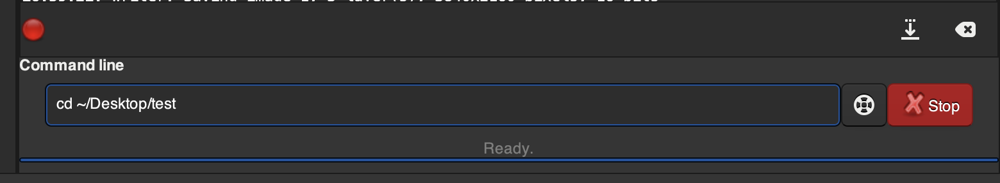

Now we're in that directory, select the tab `Conversion` on Siril, click on `+`, it'll open a window at `~/Desktop/test`, select the webm file, then select `SER Sequence`, give sequence a name (`moon` here), then click `Convert`.

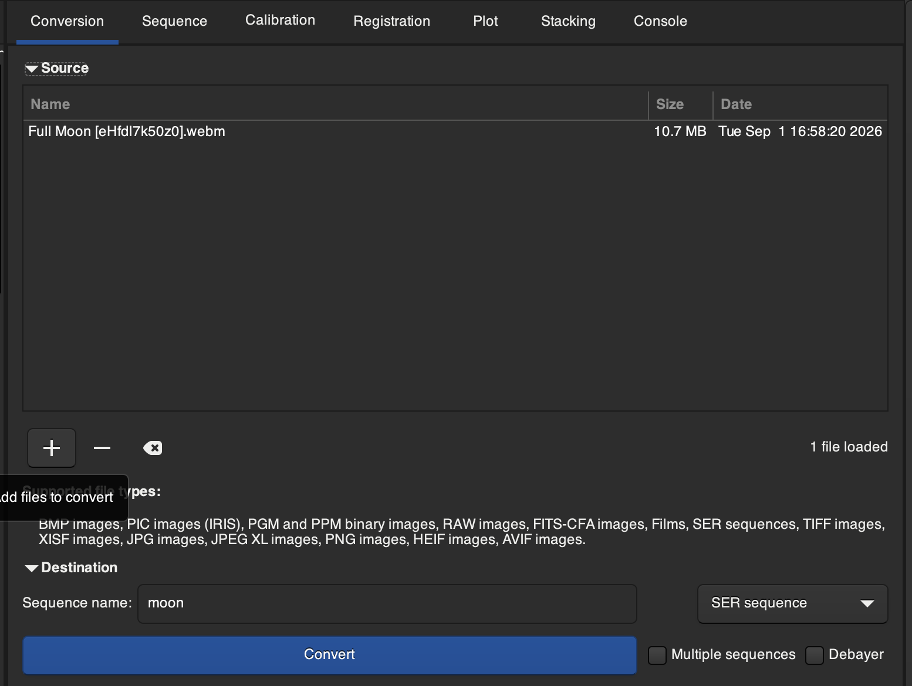

If you switch to tab `Console`, you'll see output like this. It's extracting the frames. Once done there's an image of the Moon shown up too. For this video, we end up with 1979 frames.

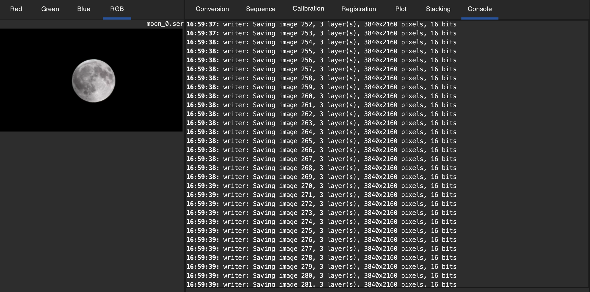

Now we need to register the frames. From [Siril's documentation](https://siril.readthedocs.io/en/stable/preprocessing/registration.html):

> Registration is basically the process of aligning the images from a sequence to be able to process them afterwards. All the processes described hereafter calculate the transformation to be applied to each image in order to be aligned with the reference image of the sequence.

Navigate to the `Registration` tab, you'll see something like this:
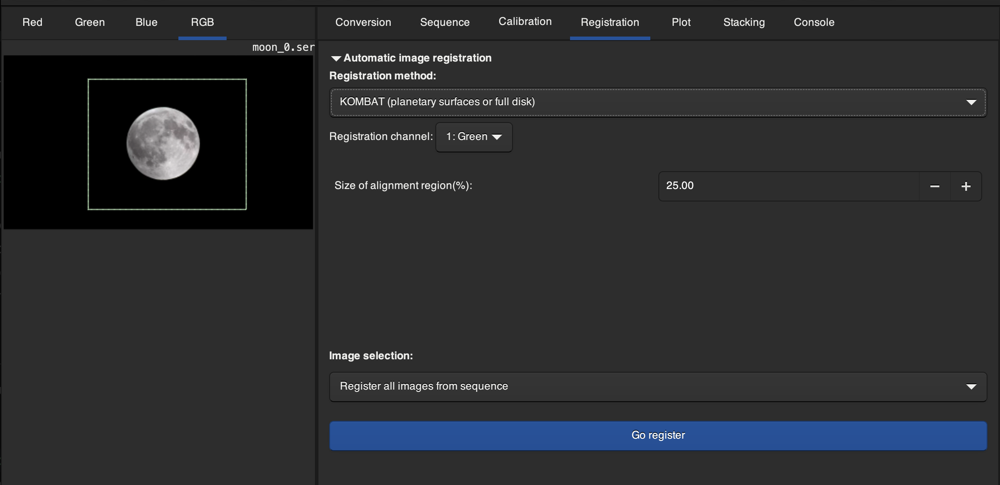

There are many registration methods, and I admit I don't fully understand any of them yet, just using for now. I use KOMBAT and it works well so far for Moon. This method requires to track and align object, so we draw a box around the moon so it knows which area to track (I think). I think the moon should stay well inside the box for the whole video, I've not tested. Once drawing the box, click "Register". It'll take a while.

Once that's done, naviage to `Plot` tab, you'll see something like this:

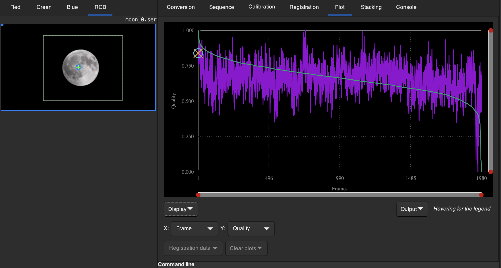

I'm not 100% sure but I think this quality score is a relative ranking score, not absolute. Essentially we're ranking all frames from top to bottom in terms of quality and each is assigned a score value with 1 is the highest and 0 is worst. Now we're selecting which frames to use for stacking based on this score.

Navigate to `Stacking` tab, select `Sum stacking` for `Method`. Again, there are many stacking methods, and I haven't tested them all but `Sum stacking` works well for me so far for Moon. Go to `Image rejection`, choose `quality` and select how many percentage of the frames you wanna use for stacking. Changing this also shows the quality score threshold you use to select images. I usually rely on the quality score threshold to determine how many to keep as well 'cuz I think even if increasing the frames to stack at the cost of introducing bad frames might end up with worse result. What's the threshold to use? I don't know, I often try 0.75 or higher and that's worked well so far. Now just click on `Start stacking` and wait a bit.

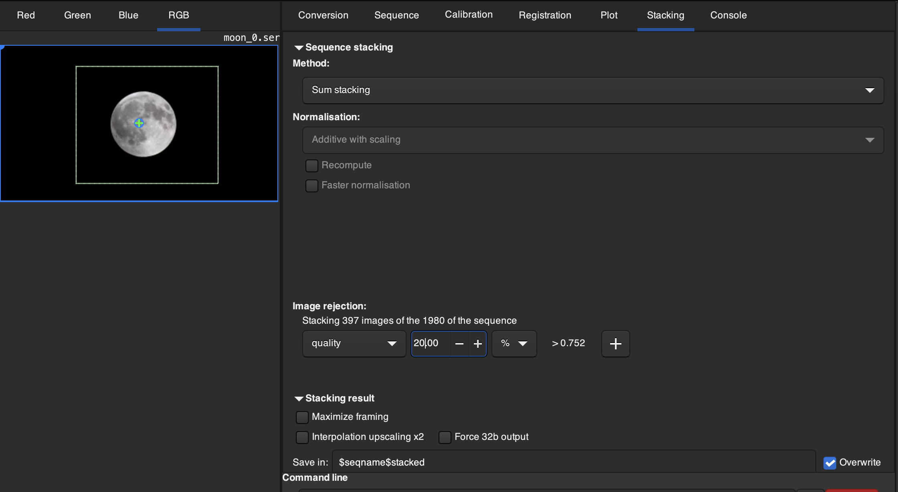

Now navigate to `Console` again you'll see something like this:
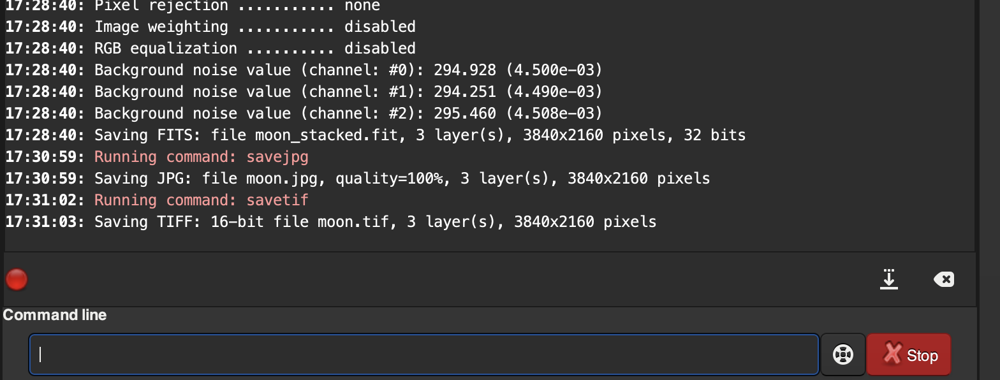

Our stacking is done! We can take a peek by entering `savejpg moon`, enter, then it'll save a `moon.jpg` as below. As you can see, it looks good, but we want better. Let's save a TIFF image which is lossless hence we can use for further editing. Simply typing into the command line box `savetif moon`, enter, it'll save a rather large file `moon.tif` (~47MB compared to 370KB of `moon.jpg` which is lossy).

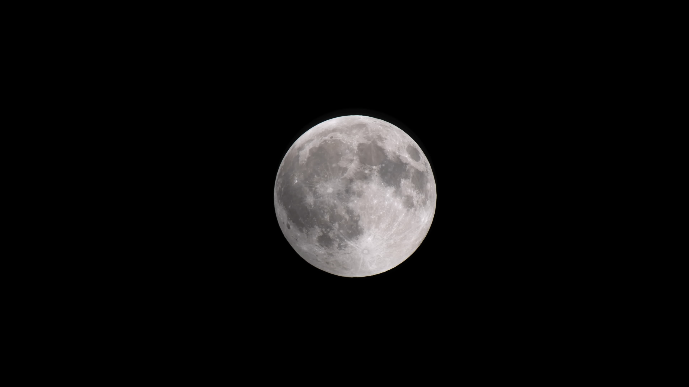


## Step 3 - Editing
This is the fun part!!! I've got next to zero experience with editing, so I'm basically following [Vaonis' tutorial](https://vaonis.com/blogs/travel-journal/tutorial-how-to-process-and-enhance-moon-and-sun-images-with-autostakkert-and-affinity-photo?srsltid=AfmBOop3sCvqbx1UGyapHsc6NFJiDsRv5h6hTmrhYCMabMuCn_Mh5hEX). I have Affinity Photo so that's what I'm using but other editing software works too.

I only do the following things:

- high-pass filtering: Moon contains a lot of high-frequency information such as crater. By frequency here we mean spatial frequency. At around the crater area, the pixel value changes rapidly and hence "high-frequency". We want to enhance this so we use high-pass filters.
- color enhancement: what's often called "Mineral Moon". The idea is different parts of the moon have different chemical and mineral composition, hence reflecting light of different frequencies and colors. The difference is very very small so to our naked eyes, it simply looks plain gray. But we can boost this difference by increasing saturation which will give some colors to the final image.


Right click on `moon.tif` and open it with Affinity Photo. First let's crop it. Just select the crop symbol on the left box, draw a rectangle around the moon, then press `Apply`.
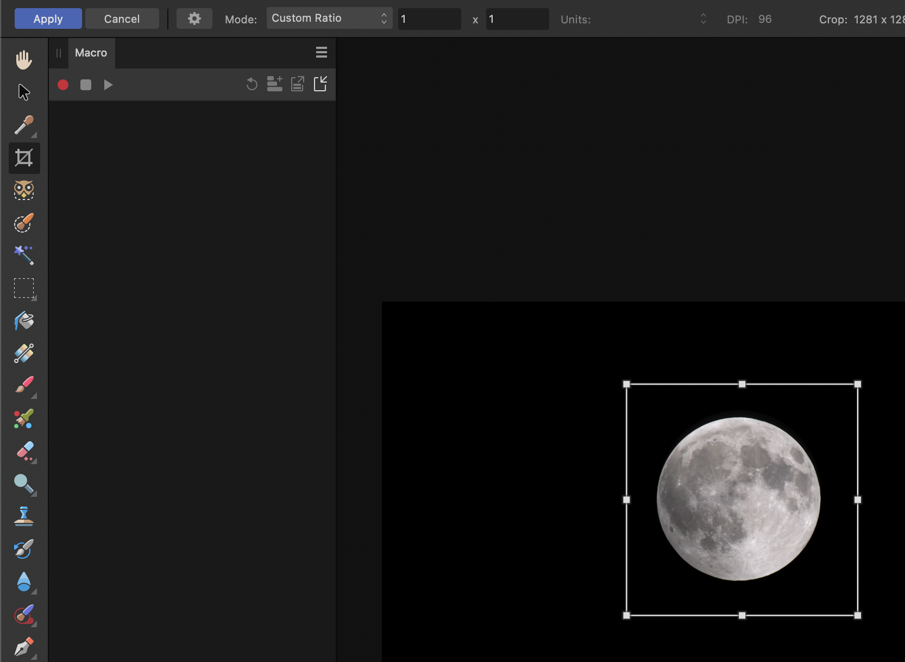

Add a high-pass filter:
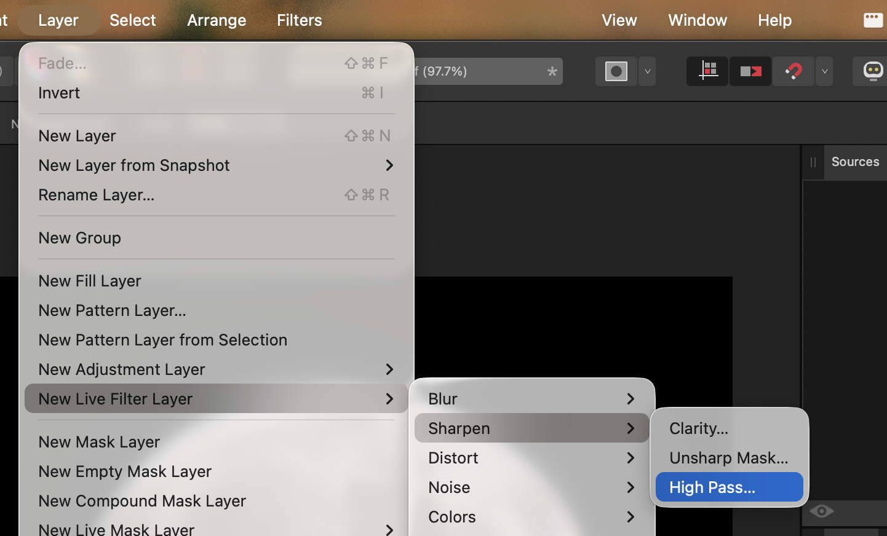

The filter layer is added to the box on the right under `Layers` tab. Move it up on top of the `Background` (our base image). If you click on the symbox of the high-pass filter, it'll open a control box where we can change the hyperparameters for high-pass filter. Set radius to 1px and use `Linear Light`. Enter and close.
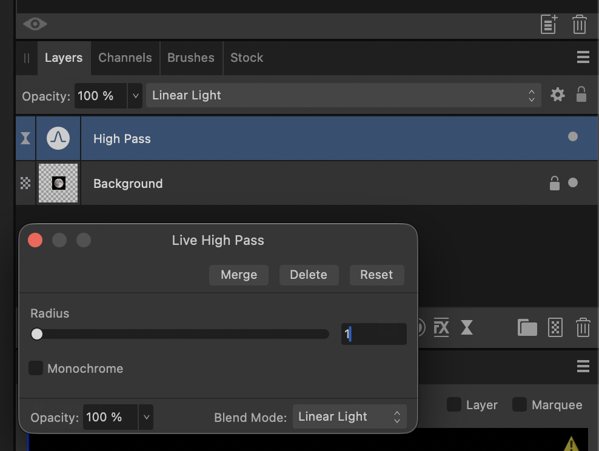

You can select that high-pass filter, cmd+C then cmd+V to paste and create new filters. They'll work in chain, meaning filter 1 -> filter 2 -> ... I use 4 filters all with `Linear Light`, radius 1px -> 1px -> 0.5px -> 0.1px. As you add more filter, you'll see it sharpening around the craters' area. How much to do depends on your taste.

Now we change saturation. Go to `Layer` -> `New adjustment layer` -> `HSL...`. Again, I copy and paste to get multiple layers and they'll work in chain. For each, you can play around with the configuration, in this example I change only `Saturation`, I do 50% -> 25% -> 10%.
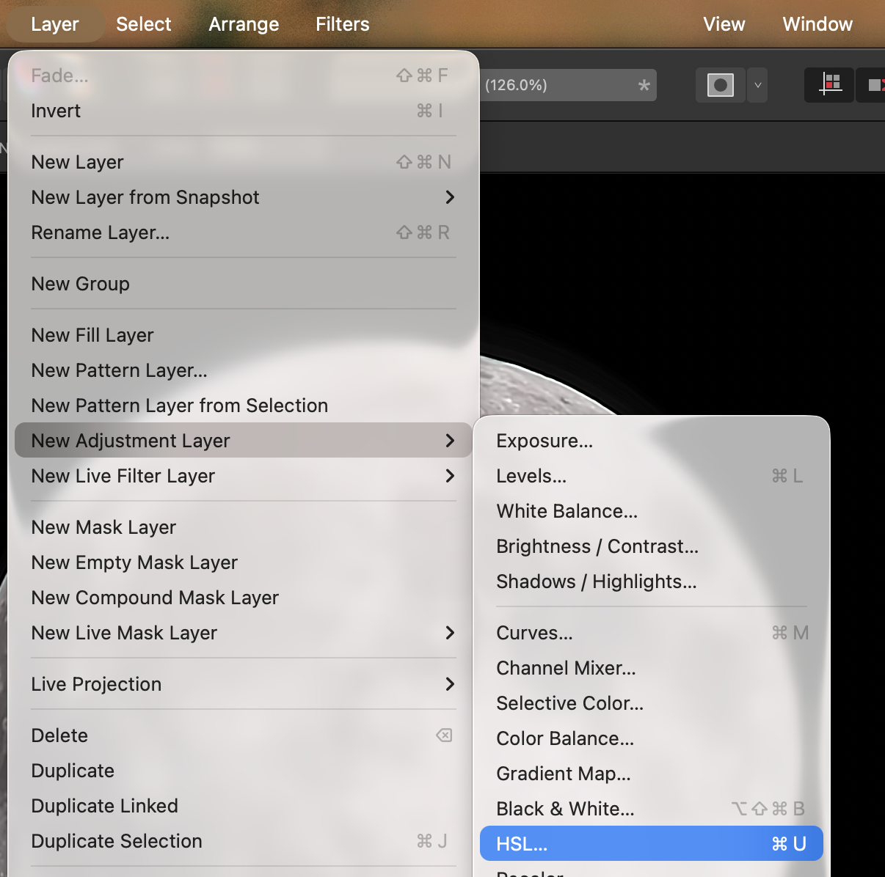
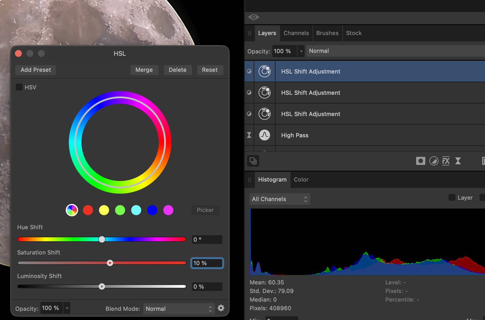

Here's what I ended up with:

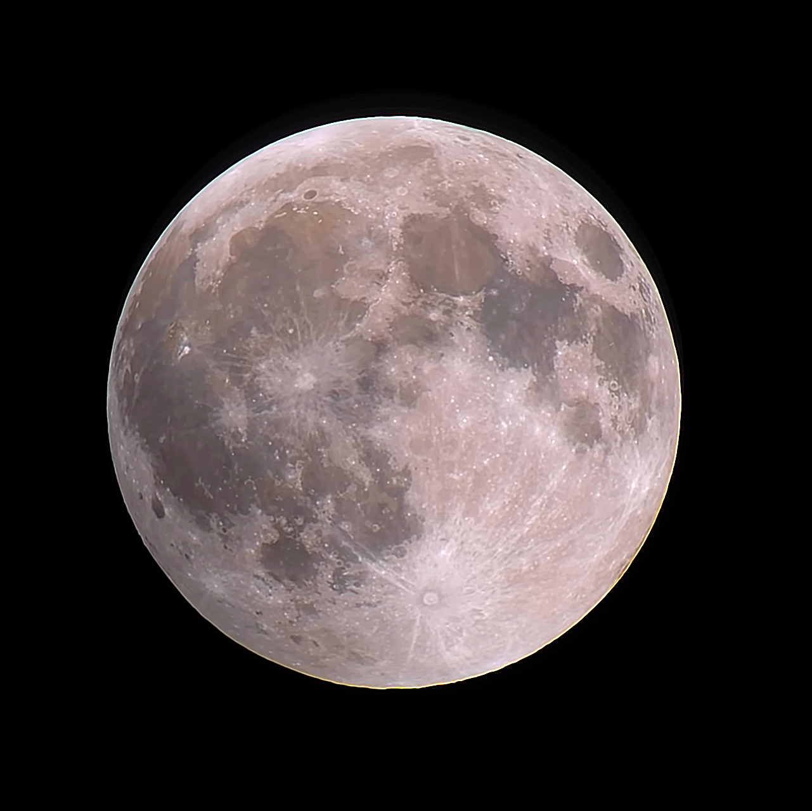


## Conclusion
I'm sure I make some mistakes or misunderstood some concepts here and there, but hopefully this post can be a good starting point for anyone who's like me a while back who's curious about how to get a sharp shot of the Moon. Of course you should try to change all the editing hyperparameters such as hue in HSL layer, add more filters of different types... Below are some example Moon shots I've taken and editing with this flow.

<blockquote class="instagram-media" data-instgrm-captioned data-instgrm-permalink="https://www.instagram.com/p/DcdeXy1nCk-/?utm_source=ig_embed&amp;utm_campaign=loading" data-instgrm-version="14" style=" background:#FFF; border:0; border-radius:3px; box-shadow:0 0 1px 0 rgba(0,0,0,0.5),0 1px 10px 0 rgba(0,0,0,0.15); margin: 1px; max-width:540px; min-width:326px; padding:0; width:99.375%; width:-webkit-calc(100% - 2px); width:calc(100% - 2px);"><div style="padding:16px;"> <a href="https://www.instagram.com/p/DcdeXy1nCk-/?utm_source=ig_embed&amp;utm_campaign=loading" style=" background:#FFFFFF; line-height:0; padding:0 0; text-align:center; text-decoration:none; width:100%;" target="_blank"> <div style=" display: flex; flex-direction: row; align-items: center;"> <div style="background-color: #F4F4F4; border-radius: 50%; flex-grow: 0; height: 40px; margin-right: 14px; width: 40px;"></div> <div style="display: flex; flex-direction: column; flex-grow: 1; justify-content: center;"> <div style=" background-color: #F4F4F4; border-radius: 4px; flex-grow: 0; height: 14px; margin-bottom: 6px; width: 100px;"></div> <div style=" background-color: #F4F4F4; border-radius: 4px; flex-grow: 0; height: 14px; width: 60px;"></div></div></div><div style="padding: 19% 0;"></div> <div style="display:block; height:50px; margin:0 auto 12px; width:50px;"><svg width="50px" height="50px" viewBox="0 0 60 60" version="1.1" xmlns="https://www.w3.org/2000/svg" xmlns:xlink="https://www.w3.org/1999/xlink"><g stroke="none" stroke-width="1" fill="none" fill-rule="evenodd"><g transform="translate(-511.000000, -20.000000)" fill="#000000"><g><path d="M556.869,30.41 C554.814,30.41 553.148,32.076 553.148,34.131 C553.148,36.186 554.814,37.852 556.869,37.852 C558.924,37.852 560.59,36.186 560.59,34.131 C560.59,32.076 558.924,30.41 556.869,30.41 M541,60.657 C535.114,60.657 530.342,55.887 530.342,50 C530.342,44.114 535.114,39.342 541,39.342 C546.887,39.342 551.658,44.114 551.658,50 C551.658,55.887 546.887,60.657 541,60.657 M541,33.886 C532.1,33.886 524.886,41.1 524.886,50 C524.886,58.899 532.1,66.113 541,66.113 C549.9,66.113 557.115,58.899 557.115,50 C557.115,41.1 549.9,33.886 541,33.886 M565.378,62.101 C565.244,65.022 564.756,66.606 564.346,67.663 C563.803,69.06 563.154,70.057 562.106,71.106 C561.058,72.155 560.06,72.803 558.662,73.347 C557.607,73.757 556.021,74.244 553.102,74.378 C549.944,74.521 548.997,74.552 541,74.552 C533.003,74.552 532.056,74.521 528.898,74.378 C525.979,74.244 524.393,73.757 523.338,73.347 C521.94,72.803 520.942,72.155 519.894,71.106 C518.846,70.057 518.197,69.06 517.654,67.663 C517.244,66.606 516.755,65.022 516.623,62.101 C516.479,58.943 516.448,57.996 516.448,50 C516.448,42.003 516.479,41.056 516.623,37.899 C516.755,34.978 517.244,33.391 517.654,32.338 C518.197,30.938 518.846,29.942 519.894,28.894 C520.942,27.846 521.94,27.196 523.338,26.654 C524.393,26.244 525.979,25.756 528.898,25.623 C532.057,25.479 533.004,25.448 541,25.448 C548.997,25.448 549.943,25.479 553.102,25.623 C556.021,25.756 557.607,26.244 558.662,26.654 C560.06,27.196 561.058,27.846 562.106,28.894 C563.154,29.942 563.803,30.938 564.346,32.338 C564.756,33.391 565.244,34.978 565.378,37.899 C565.522,41.056 565.552,42.003 565.552,50 C565.552,57.996 565.522,58.943 565.378,62.101 M570.82,37.631 C570.674,34.438 570.167,32.258 569.425,30.349 C568.659,28.377 567.633,26.702 565.965,25.035 C564.297,23.368 562.623,22.342 560.652,21.575 C558.743,20.834 556.562,20.326 553.369,20.18 C550.169,20.033 549.148,20 541,20 C532.853,20 531.831,20.033 528.631,20.18 C525.438,20.326 523.257,20.834 521.349,21.575 C519.376,22.342 517.703,23.368 516.035,25.035 C514.368,26.702 513.342,28.377 512.574,30.349 C511.834,32.258 511.326,34.438 511.181,37.631 C511.035,40.831 511,41.851 511,50 C511,58.147 511.035,59.17 511.181,62.369 C511.326,65.562 511.834,67.743 512.574,69.651 C513.342,71.625 514.368,73.296 516.035,74.965 C517.703,76.634 519.376,77.658 521.349,78.425 C523.257,79.167 525.438,79.673 528.631,79.82 C531.831,79.965 532.853,80.001 541,80.001 C549.148,80.001 550.169,79.965 553.369,79.82 C556.562,79.673 558.743,79.167 560.652,78.425 C562.623,77.658 564.297,76.634 565.965,74.965 C567.633,73.296 568.659,71.625 569.425,69.651 C570.167,67.743 570.674,65.562 570.82,62.369 C570.966,59.17 571,58.147 571,50 C571,41.851 570.966,40.831 570.82,37.631"></path></g></g></g></svg></div><div style="padding-top: 8px;"> <div style=" color:#3897f0; font-family:Arial,sans-serif; font-size:14px; font-style:normal; font-weight:550; line-height:18px;">View this post on Instagram</div></div><div style="padding: 12.5% 0;"></div> <div style="display: flex; flex-direction: row; margin-bottom: 14px; align-items: center;"><div> <div style="background-color: #F4F4F4; border-radius: 50%; height: 12.5px; width: 12.5px; transform: translateX(0px) translateY(7px);"></div> <div style="background-color: #F4F4F4; height: 12.5px; transform: rotate(-45deg) translateX(3px) translateY(1px); width: 12.5px; flex-grow: 0; margin-right: 14px; margin-left: 2px;"></div> <div style="background-color: #F4F4F4; border-radius: 50%; height: 12.5px; width: 12.5px; transform: translateX(9px) translateY(-18px);"></div></div><div style="margin-left: 8px;"> <div style=" background-color: #F4F4F4; border-radius: 50%; flex-grow: 0; height: 20px; width: 20px;"></div> <div style=" width: 0; height: 0; border-top: 2px solid transparent; border-left: 6px solid #f4f4f4; border-bottom: 2px solid transparent; transform: translateX(16px) translateY(-4px) rotate(30deg)"></div></div><div style="margin-left: auto;"> <div style=" width: 0px; border-top: 8px solid #F4F4F4; border-right: 8px solid transparent; transform: translateY(16px);"></div> <div style=" background-color: #F4F4F4; flex-grow: 0; height: 12px; width: 16px; transform: translateY(-4px);"></div> <div style=" width: 0; height: 0; border-top: 8px solid #F4F4F4; border-left: 8px solid transparent; transform: translateY(-4px) translateX(8px);"></div></div></div> <div style="display: flex; flex-direction: column; flex-grow: 1; justify-content: center; margin-bottom: 24px;"> <div style=" background-color: #F4F4F4; border-radius: 4px; flex-grow: 0; height: 14px; margin-bottom: 6px; width: 224px;"></div> <div style=" background-color: #F4F4F4; border-radius: 4px; flex-grow: 0; height: 14px; width: 144px;"></div></div></a><p style=" color:#c9c8cd; font-family:Arial,sans-serif; font-size:14px; line-height:17px; margin-bottom:0; margin-top:8px; overflow:hidden; padding:8px 0 7px; text-align:center; text-overflow:ellipsis; white-space:nowrap;"><a href="https://www.instagram.com/p/DcdeXy1nCk-/?utm_source=ig_embed&amp;utm_campaign=loading" style=" color:#c9c8cd; font-family:Arial,sans-serif; font-size:14px; font-style:normal; font-weight:normal; line-height:17px; text-decoration:none;" target="_blank">A post shared by Lei Haas (@leisaueha)</a></p></div></blockquote>

<blockquote class="instagram-media" data-instgrm-captioned data-instgrm-permalink="https://www.instagram.com/p/DcmxuKYEc4w/?utm_source=ig_embed&amp;utm_campaign=loading" data-instgrm-version="14" style=" background:#FFF; border:0; border-radius:3px; box-shadow:0 0 1px 0 rgba(0,0,0,0.5),0 1px 10px 0 rgba(0,0,0,0.15); margin: 1px; max-width:540px; min-width:326px; padding:0; width:99.375%; width:-webkit-calc(100% - 2px); width:calc(100% - 2px);"><div style="padding:16px;"> <a href="https://www.instagram.com/p/DcmxuKYEc4w/?utm_source=ig_embed&amp;utm_campaign=loading" style=" background:#FFFFFF; line-height:0; padding:0 0; text-align:center; text-decoration:none; width:100%;" target="_blank"> <div style=" display: flex; flex-direction: row; align-items: center;"> <div style="background-color: #F4F4F4; border-radius: 50%; flex-grow: 0; height: 40px; margin-right: 14px; width: 40px;"></div> <div style="display: flex; flex-direction: column; flex-grow: 1; justify-content: center;"> <div style=" background-color: #F4F4F4; border-radius: 4px; flex-grow: 0; height: 14px; margin-bottom: 6px; width: 100px;"></div> <div style=" background-color: #F4F4F4; border-radius: 4px; flex-grow: 0; height: 14px; width: 60px;"></div></div></div><div style="padding: 19% 0;"></div> <div style="display:block; height:50px; margin:0 auto 12px; width:50px;"><svg width="50px" height="50px" viewBox="0 0 60 60" version="1.1" xmlns="https://www.w3.org/2000/svg" xmlns:xlink="https://www.w3.org/1999/xlink"><g stroke="none" stroke-width="1" fill="none" fill-rule="evenodd"><g transform="translate(-511.000000, -20.000000)" fill="#000000"><g><path d="M556.869,30.41 C554.814,30.41 553.148,32.076 553.148,34.131 C553.148,36.186 554.814,37.852 556.869,37.852 C558.924,37.852 560.59,36.186 560.59,34.131 C560.59,32.076 558.924,30.41 556.869,30.41 M541,60.657 C535.114,60.657 530.342,55.887 530.342,50 C530.342,44.114 535.114,39.342 541,39.342 C546.887,39.342 551.658,44.114 551.658,50 C551.658,55.887 546.887,60.657 541,60.657 M541,33.886 C532.1,33.886 524.886,41.1 524.886,50 C524.886,58.899 532.1,66.113 541,66.113 C549.9,66.113 557.115,58.899 557.115,50 C557.115,41.1 549.9,33.886 541,33.886 M565.378,62.101 C565.244,65.022 564.756,66.606 564.346,67.663 C563.803,69.06 563.154,70.057 562.106,71.106 C561.058,72.155 560.06,72.803 558.662,73.347 C557.607,73.757 556.021,74.244 553.102,74.378 C549.944,74.521 548.997,74.552 541,74.552 C533.003,74.552 532.056,74.521 528.898,74.378 C525.979,74.244 524.393,73.757 523.338,73.347 C521.94,72.803 520.942,72.155 519.894,71.106 C518.846,70.057 518.197,69.06 517.654,67.663 C517.244,66.606 516.755,65.022 516.623,62.101 C516.479,58.943 516.448,57.996 516.448,50 C516.448,42.003 516.479,41.056 516.623,37.899 C516.755,34.978 517.244,33.391 517.654,32.338 C518.197,30.938 518.846,29.942 519.894,28.894 C520.942,27.846 521.94,27.196 523.338,26.654 C524.393,26.244 525.979,25.756 528.898,25.623 C532.057,25.479 533.004,25.448 541,25.448 C548.997,25.448 549.943,25.479 553.102,25.623 C556.021,25.756 557.607,26.244 558.662,26.654 C560.06,27.196 561.058,27.846 562.106,28.894 C563.154,29.942 563.803,30.938 564.346,32.338 C564.756,33.391 565.244,34.978 565.378,37.899 C565.522,41.056 565.552,42.003 565.552,50 C565.552,57.996 565.522,58.943 565.378,62.101 M570.82,37.631 C570.674,34.438 570.167,32.258 569.425,30.349 C568.659,28.377 567.633,26.702 565.965,25.035 C564.297,23.368 562.623,22.342 560.652,21.575 C558.743,20.834 556.562,20.326 553.369,20.18 C550.169,20.033 549.148,20 541,20 C532.853,20 531.831,20.033 528.631,20.18 C525.438,20.326 523.257,20.834 521.349,21.575 C519.376,22.342 517.703,23.368 516.035,25.035 C514.368,26.702 513.342,28.377 512.574,30.349 C511.834,32.258 511.326,34.438 511.181,37.631 C511.035,40.831 511,41.851 511,50 C511,58.147 511.035,59.17 511.181,62.369 C511.326,65.562 511.834,67.743 512.574,69.651 C513.342,71.625 514.368,73.296 516.035,74.965 C517.703,76.634 519.376,77.658 521.349,78.425 C523.257,79.167 525.438,79.673 528.631,79.82 C531.831,79.965 532.853,80.001 541,80.001 C549.148,80.001 550.169,79.965 553.369,79.82 C556.562,79.673 558.743,79.167 560.652,78.425 C562.623,77.658 564.297,76.634 565.965,74.965 C567.633,73.296 568.659,71.625 569.425,69.651 C570.167,67.743 570.674,65.562 570.82,62.369 C570.966,59.17 571,58.147 571,50 C571,41.851 570.966,40.831 570.82,37.631"></path></g></g></g></svg></div><div style="padding-top: 8px;"> <div style=" color:#3897f0; font-family:Arial,sans-serif; font-size:14px; font-style:normal; font-weight:550; line-height:18px;">View this post on Instagram</div></div><div style="padding: 12.5% 0;"></div> <div style="display: flex; flex-direction: row; margin-bottom: 14px; align-items: center;"><div> <div style="background-color: #F4F4F4; border-radius: 50%; height: 12.5px; width: 12.5px; transform: translateX(0px) translateY(7px);"></div> <div style="background-color: #F4F4F4; height: 12.5px; transform: rotate(-45deg) translateX(3px) translateY(1px); width: 12.5px; flex-grow: 0; margin-right: 14px; margin-left: 2px;"></div> <div style="background-color: #F4F4F4; border-radius: 50%; height: 12.5px; width: 12.5px; transform: translateX(9px) translateY(-18px);"></div></div><div style="margin-left: 8px;"> <div style=" background-color: #F4F4F4; border-radius: 50%; flex-grow: 0; height: 20px; width: 20px;"></div> <div style=" width: 0; height: 0; border-top: 2px solid transparent; border-left: 6px solid #f4f4f4; border-bottom: 2px solid transparent; transform: translateX(16px) translateY(-4px) rotate(30deg)"></div></div><div style="margin-left: auto;"> <div style=" width: 0px; border-top: 8px solid #F4F4F4; border-right: 8px solid transparent; transform: translateY(16px);"></div> <div style=" background-color: #F4F4F4; flex-grow: 0; height: 12px; width: 16px; transform: translateY(-4px);"></div> <div style=" width: 0; height: 0; border-top: 8px solid #F4F4F4; border-left: 8px solid transparent; transform: translateY(-4px) translateX(8px);"></div></div></div> <div style="display: flex; flex-direction: column; flex-grow: 1; justify-content: center; margin-bottom: 24px;"> <div style=" background-color: #F4F4F4; border-radius: 4px; flex-grow: 0; height: 14px; margin-bottom: 6px; width: 224px;"></div> <div style=" background-color: #F4F4F4; border-radius: 4px; flex-grow: 0; height: 14px; width: 144px;"></div></div></a><p style=" color:#c9c8cd; font-family:Arial,sans-serif; font-size:14px; line-height:17px; margin-bottom:0; margin-top:8px; overflow:hidden; padding:8px 0 7px; text-align:center; text-overflow:ellipsis; white-space:nowrap;"><a href="https://www.instagram.com/p/DcmxuKYEc4w/?utm_source=ig_embed&amp;utm_campaign=loading" style=" color:#c9c8cd; font-family:Arial,sans-serif; font-size:14px; font-style:normal; font-weight:normal; line-height:17px; text-decoration:none;" target="_blank">A post shared by Lei Haas (@leisaueha)</a></p></div></blockquote>

<script setup>
import { onMounted, nextTick } from 'vue'

onMounted(async () => {
  await nextTick()

  if (window.instgrm?.Embeds) {
    window.instgrm.Embeds.process()
  } else {
    const script = document.createElement('script')
    script.src = 'https://www.instagram.com/embed.js'
    script.async = true
    script.onload = () => window.instgrm?.Embeds.process()
    document.body.appendChild(script)
  }
})
</script>
