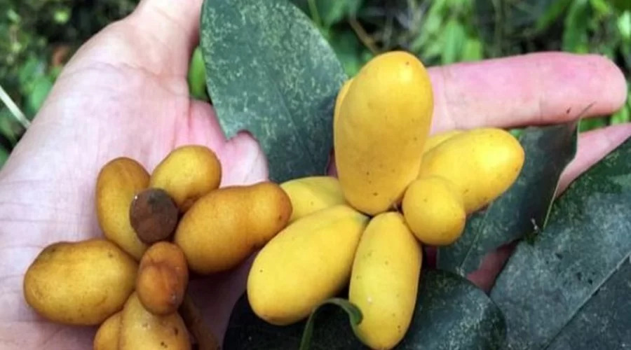
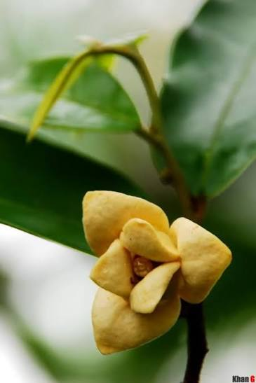
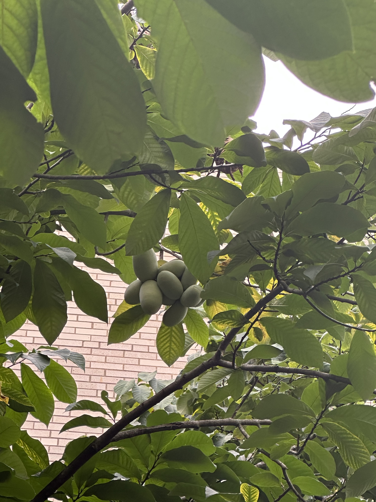
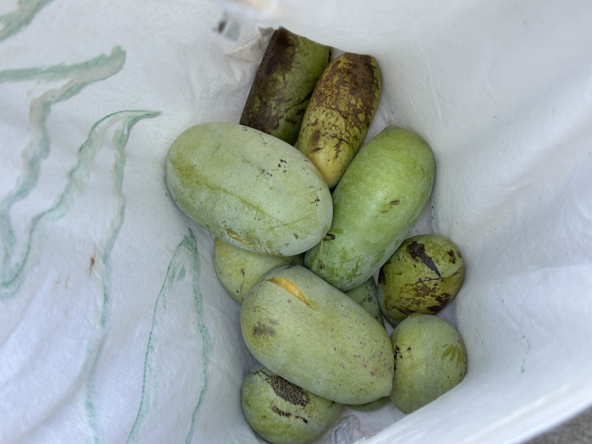
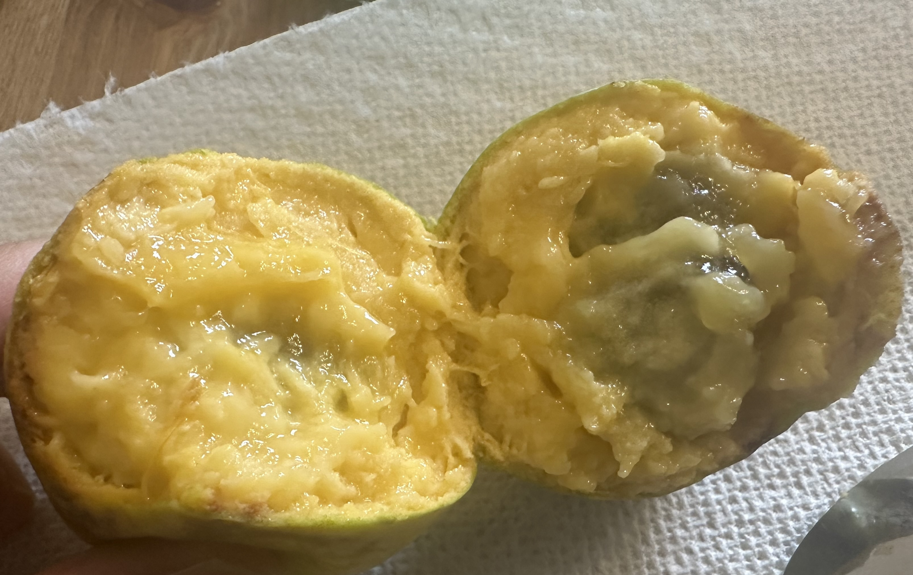
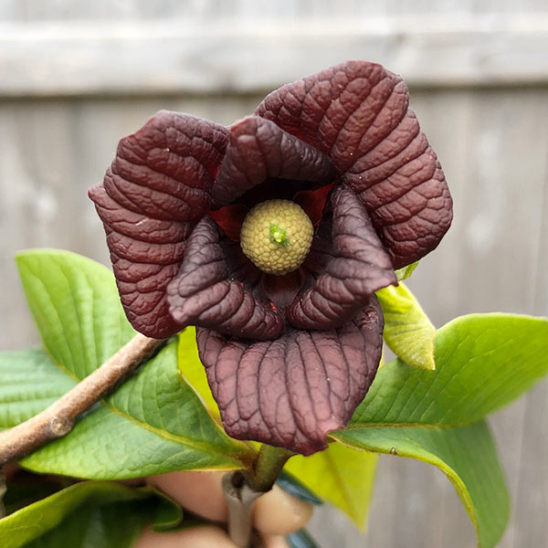

# Pawpaw

When I first moved to Missouri, I was introduced to a native North American fruit called pawpaw. My first impression was how similar it looks to "dủ dẻ." You see, dủ dẻ is a wild plant with a delicious fruit that turns yellow when ripe. As a kid growing up in central Vietnam, I don't recall seeing anyone growing that plant. Every now and then, we just happened to stumble upon one and enjoyed the delicious fruit. If my memory serves, I remember often finding them in wild shrubs in cemetery areas lol.

Not only do pawpaw fruits look like dủ dẻ, they taste similar too. I honestly don't know how to best describe it, but many have said it's sort of like a combination of mango, pineapple, and custard. I do agree with the mango and custard part. Since I don't have any photos of dủ dẻ, I just have to look up the [fruit](https://kobi.vn/blog/cay-du-de-tim-hieu-ve-thuc-vat-tuoi-tho?srsltid=AfmBOopUL3uH4nW05yUqmLvoyzyDAdaDQFftOBzYqSCTqZ9Cqu0ZPuO0) and [flower](https://ytevinhcuu.com/y-hoc-co-truyen/cay-thuoc-quanh-ta/cay-du-de) on the internet.

And here are the pawpaw fruits I foraged. The flower pic is from the [internet](https://onegreenworld.com/a-peak-into-pawpaw-pollination/).

As you can see, even their flowers look similar. A quick search on Wikipedia shows that both [dủ dẻ](https://vi.wikipedia.org/wiki/D%C5%A9_d%E1%BA%BB_tr%C3%A2u) and [pawpaw](https://en.wikipedia.org/wiki/Asimina_triloba) belong to the [Annonaceae](https://en.wikipedia.org/wiki/Annonaceae) family. I guess that explains the similarity, but I'd love to know more about how two plants from places so far apart ended up being so closely related.

I don't know how others forage for pawpaw. I've never successfully gotten green, young pawpaws to ripen, so I just harvest the tree-ripe ones. When ripe, pawpaw fruits fall off the tree easily, so all I have to do is hold onto the tree and shake it. Be careful, some big ones are very heavy, so maybe wear a helmet lol.

Pawpaw is one of those wonderful seasonal treats, so if by chance you come across it during pawpaw season, and it is legal and safe to forage where you are, try some of that delicious local fruit.