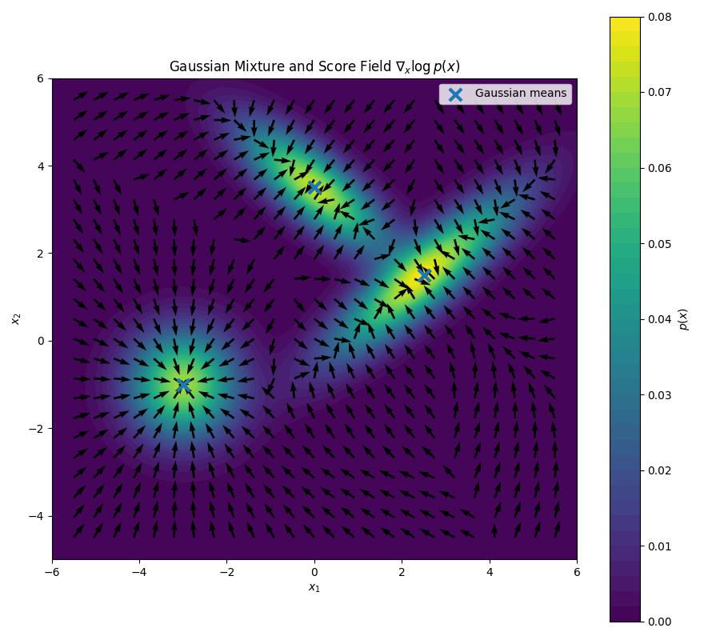

# Diffusion via Score Matching
Continue with Diffusion, I read part 3 of chapter 20 of the book "Deep Learning" by Bishop Father and Son. Here's my note along the way. Similar to previous post on [ddpm](./ddpm.md), there could be a lot of mistakes.

## Note

Instead of [DDPM](./ddpm.md), we look at diffusion from the score matching perspective.

The score function:

$$
s(x) = \nabla_x \ln p(x)
$$

(Note that this is the gradient w.r.t. $x$.) For example, below is visualization of score function of a mixture of Gaussians

Why is it useful? Because if we know the score function, we can generate new data using Langevin sampling:

$$
x_{k+1} - x_k
=
\frac{\epsilon}{2}\nabla \ln p(x_k)
+
\sqrt{\epsilon}\,z_k
$$

Another cool characteristic of the score function is that it doesn't depend on the normalization constant. I.e., if $q(x)$ has the same score function as $p(x)$:

$$
\nabla_x \ln q(x)
=
\nabla_x \ln p(x)
$$

then:

$$
q(x) = Kp(x)
$$

More precisely, $K$ is constant within each connected component of the support. If $p$ and $q$ are both normalized and have connected common support, then $K=1$.

So to learn $s(x)$, we just need a model $s(x,w)$.

If we learn $s(x,w)\approx s(x)$, we can use the score without having to learn the normalization constant of $p(x)$.

To match the two:

$$
J(w)
=
\frac{1}{2}
\int
\left\|
s(x,w) - \nabla_x \ln p(x)
\right\|^2
p(x)\,dx
$$

We don't know $p(x)$, so we use the empirical distribution:

$$
p_D(x)
=
\frac{1}{N}
\sum_{n=1}^{N}
\delta(x-x_n)
$$

with $\delta$ = Dirac delta function,

$$
\delta(x)=0,\qquad x\neq 0
$$

$$
\int \delta(x)\,dx=1
$$

$\rightarrow$ Informally, it is an infinitely narrow spike at $x=0$; formally, it is a distribution rather than an ordinary function.

Thus, $p_D(x)$ is not differentiable either. We therefore work with a "smeared out" / smoothed density:

$$
q_\sigma(z)
=
\int q(z|x,\sigma)\,p(x)\,dx
$$

Often used:

$$
q(z|x,\sigma)
=
\mathcal{N}(z|x,\sigma^2 I)
$$

As $\sigma\to0$, $q(z|x,\sigma)$ approaches a Dirac delta centered at $x$, so $q_\sigma(z)$ approaches $p(x)$ in the distributional sense.

To sum up, we wanna learn $p(x)$, but we only have samples from it. We smooth the distribution into $q_\sigma(z)$ and approximate expectations over $p(x)$ using the empirical distribution $p_D(x)$. As $\sigma\to0$, $q_\sigma$ approaches $p$, and the noisy sample $z$ stays closer to $x$.

So instead of matching $p(x)$ directly, we match the score of the smooth density $q_\sigma(z)$. With a small $\sigma$ and a lot of data, $q_\sigma$ can approximate the underlying data distribution while still having a well-defined score.

Now:

$$
J(w)
=
\frac{1}{2}
\int
\left\|
s(z,w)-\nabla_z\ln q_\sigma(z)
\right\|^2
q_\sigma(z)\,dz
$$

Since:

$$
q_\sigma(z)
=
\int q(z|x,\sigma)p(x)\,dx
$$

we'll show that:

$$
J(w)=J'(w)+\text{const}
$$

with:

$$
J'(w)
=
\frac{1}{2}
\iint
\left\|
s(z,w)-\nabla_z\ln q(z|x,\sigma)
\right\|^2
q(z|x,\sigma)p(x)\,dz\,dx
$$

We'll expand the $(\cdot)^2$ and compare the corresponding pairs of terms.

1. First terms:

$$
\int \left\|s(z,w)\right\|^2 q_\sigma(z)\,dz
$$

and

$$
\iint \left\|s(z,w)\right\|^2q(z|x,\sigma)p(x)\,dz\,dx
$$

For the second:

$$
\begin{aligned}
\iint \left\|s(z,w)\right\|^2q(z|x,\sigma)p(x)\,dz\,dx
&=
\int \left\|s(z,w)\right\|^2
\left[
\int q(z|x,\sigma)p(x)\,dx
\right]dz \\
&=
\int \left\|s(z,w)\right\|^2q_\sigma(z)\,dz
\end{aligned}
$$

(by definition)

So they're the same.

2. Second terms:

$$
\int
\left\|
\nabla_z\ln q_\sigma(z)
\right\|^2
q_\sigma(z)\,dz
$$

and

$$
\iint
\left\|
\nabla_z\ln q(z|x,\sigma)
\right\|^2
q(z|x,\sigma)p(x)\,dz\,dx
$$

Both are independent of $w$ $\rightarrow$ considered constants.

3. Cross terms:

$$
\int
s(z,w)^\top\nabla_z\ln q_\sigma(z)\,q_\sigma(z)\,dz
$$

and

$$
\iint
s(z,w)^\top
\nabla_z\ln q(z|x,\sigma)
q(z|x,\sigma)p(x)\,dz\,dx
$$

We have the first cross term:

$$
\begin{aligned}
\int
s(z,w)^\top\nabla_z\ln q_\sigma(z)q_\sigma(z)\,dz
&=
\int
s(z,w)^\top
\frac{\nabla_z q_\sigma(z)}{q_\sigma(z)}
q_\sigma(z)\,dz \\
&=
\int
s(z,w)^\top\nabla_z q_\sigma(z)\,dz
\end{aligned}
$$

Second:

$$
\begin{aligned}
&\iint
s(z,w)^\top
\nabla_z\ln q(z|x,\sigma)
q(z|x,\sigma)p(x)\,dz\,dx \\
&=
\iint
s(z,w)^\top
\frac{\nabla_zq(z|x,\sigma)}
{q(z|x,\sigma)}
q(z|x,\sigma)p(x)\,dz\,dx \\
&=
\int s(z,w)^\top
\left[
\int
\nabla_zq(z|x,\sigma)p(x)\,dx
\right]dz
\end{aligned}
$$

We can move $\nabla_z$ through the integral over $x$ $\rightarrow$

$$
\begin{aligned}
&=
\int s(z,w)^\top
\nabla_z
\left[
\int q(z|x,\sigma)p(x)\,dx
\right]dz \\
&=
\int s(z,w)^\top\nabla_zq_\sigma(z)\,dz
\end{aligned}
$$

So the cross terms are equal.

Therefore:

$$
J(w)=J'(w)+\text{constant}
$$

So we can just use $J'(w)$ (use $J(w)$ notation from now):

$$
J(w)
=
\frac{1}{2}
\iint
\left\|
s(z,w)-\nabla_z\ln q(z|x,\sigma)
\right\|^2
q(z|x,\sigma)p(x)\,dz\,dx
$$

And by replacing $p(x)$ with $p_D(x)$:

$$
J(w)
=
\frac{1}{2N}
\sum_{n=1}^{N}
\int
\left\|
s(z,w)-\nabla_z\ln q(z|x_n,\sigma)
\right\|^2
q(z|x_n,\sigma)\,dz
$$

Since:

$$
q(z|x,\sigma)
=
\mathcal{N}(z|x,\sigma^2I)
=
\frac{1}{(2\pi\sigma^2)^{d/2}}
\exp\left(
-\frac{\|z-x\|^2}{2\sigma^2}
\right)
$$

$$
\ln q(z|x,\sigma)
=
-\frac{\|z-x\|^2}{2\sigma^2}+C
$$

$$
\nabla_z\ln q(z|x,\sigma)
=
-\frac{z-x}{\sigma^2}
$$

And because:

$$
z=x+\sigma\epsilon,
\qquad
\epsilon\sim\mathcal{N}(0,I)
$$

then:

$$
\nabla_z\ln q(z|x,\sigma)
=
-\frac{\epsilon}{\sigma},
\qquad
\epsilon\sim\mathcal{N}(0,I)
$$

So we can write:

$$
J(w)
=
\frac{1}{2N}
\sum_{n=1}^{N}
\mathbb{E}_{q(z|x_n,\sigma)}
\left[
\left\|
s(z,w)+\frac{\epsilon}{\sigma}
\right\|^2
\right]
$$

So the score model predicts scaled negative noise. Equivalently, if a model predicts the noise $\epsilon$ directly, as in DDPM, its score estimate is

$$
s(z,w)=-\frac{\epsilon_w(z,\sigma)}{\sigma}.
$$

The book mentions 3 problems with this approach:

1. “If the data distribution lies on a manifold of lower dimensionality than the data space, the probability density will be zero at points off the manifold and here the score function is undefined since $\ln p(x)$ is undefined.”

2. “In regions of low data density, the estimate of the score function may be inaccurate since the loss function (20.43) is weighted by the density. An inaccurate score function can lead to poor trajectories when using Langevin sampling.”

3. “Even with an accurate model of the score function, the Langevin procedure may not sample correctly if the data distribution comprises a mixture of disjoint distributions.”

All three can be mitigated by using a large enough noise level $\sigma$. We discussed point 1 and 3 in [this post about langevin sampling on mixtured of disjoint distributions](./langevin_sampling_mixture_of_disjoint_distributions.md).

But a large $\sigma$ smears the data too much.

$\rightarrow$ instead, learn at multiple noise levels:

$$
\sigma_T^2>\sigma_{T-1}^2>\cdots>\sigma_1^2
$$

The score network then also takes in the noise level, and the loss is weighted:

$$
J(w)
=
\frac{1}{2N}
\sum_{i=1}^{T}
\lambda(i)
\sum_{n=1}^{N}
\mathbb{E}_{q(z|x_n,\sigma_i)}
\left[
\left\|
s(z,w,\sigma_i)-\nabla_z\ln q(z|x_n,\sigma_i)
\right\|^2
\right]
$$

This is closely related to [DDPM](./ddpm.md#the-full-noise-prediction-objective). After reparameterizing the score model as a noise-prediction model, both train by predicting the noise added at different noise levels. Their exact weighting and noise schedules can differ.

$$
\mathcal{J}_{ddpm}(w)
=
\sum_{t=1}^{T}
\mathbb{E}_{q(z_t\mid x)}
\left[
\frac{\beta_t}{2(1-\beta_t)(1-\alpha_t)}
\left\|
g(z_t,w,t)-\epsilon_t
\right\|^2
\right]
$$

The book mentions that at inference time, we go from the highest noise level to the lowest. At each level, we run a few steps of Langevin sampling.

While DDPM is very clear, as we keep adding noise from one step to the next, score-matching inference is a bit less intuitive, in my opinion. The way I think about it is like dropping paint onto the surface of water and watching it slowly spread out, or "smear out." If we take snapshots at different times, they are like the different noise levels used in score matching. Although each noisy distribution is constructed directly from the original data distribution during training, level $l+1$ can still be viewed as level $l$ smeared out a bit more.

During inference, we first use multiple Langevin steps to move toward the distribution at level $l+1$. Once we have a good sample from that distribution, it provides a useful starting point for level $l$, especially when the two noise levels are close. Repeating this process gradually moves the sample from a heavily smeared-out distribution toward the data distribution.

| DDPM | NCSN / Score Matching |
|---|---|
| Noise schedule $\beta_t$ | Noise schedule $\sigma_t$ |
| $z_t = \sqrt{\bar{\alpha}_t}x + \sqrt{1-\bar{\alpha}_t}\epsilon$ | $z = x + \sigma_t\epsilon$ |
| Predict $\epsilon$ | Predict $s(z,\sigma_t) \approx -\epsilon/\sigma_t$ |
| Reverse diffusion update | Langevin update |
| One reverse step per $t$ | Multiple Langevin steps per $\sigma_t$ |
| $t=T\rightarrow1$ | $\sigma_T\rightarrow\sigma_1$ |

## Training & Inference

The book doesn't include the training algorithm, but from the objective above it should look like this:

For each training step:

1. Sample a minibatch $\{x_b\}_{b=1}^{B}$ from the training data.

2. For every $x_b$, sample a noise-level index:

$$
i_b\sim\operatorname{Uniform}\{1,\ldots,T\}.
$$

3. Sample Gaussian noise and perturb each data point directly:

$$
\epsilon_b\sim\mathcal{N}(0,I),
\qquad
z_b=x_b+\sigma_{i_b}\epsilon_b.
$$

4. Use the score network to predict:

$$
s(z_b,w,\sigma_{i_b}).
$$

5. Compute the weighted denoising score-matching loss:

$$
\widehat J(w)
=
\frac{1}{2B}
\sum_{b=1}^{B}
\lambda(i_b)
\left\|
s(z_b,w,\sigma_{i_b})
+
\frac{\epsilon_b}{\sigma_{i_b}}
\right\|^2.
$$

6. Take an optimizer step using $\nabla_w\widehat J(w)$.

A common choice is $\lambda(i)=\sigma_i^2$, which prevents the small-noise levels, with targets proportional to $1/\sigma_i$, from dominating the loss.

Of course, while the network takes in $\sigma_i$, it doesn't take in that value literally, but rather an embedding representation of it. This is similar to how in DDPM, the network takes in the time step $t$. We use the same implementation to represent $\sigma_i$ in network as well, i.e. sinusoidal embedding.

At inference time, we go from highest noise level to smallest. At each level, we run a few Langevin sampling steps using:

$$
x_{k+1} - x_k
=
\frac{\epsilon}{2}\nabla \ln p(x_k)
+
\sqrt{\epsilon}\,z_k
$$

What's a good starting point for inference? At the highest noise level,

$$
z=x+\sigma_T\epsilon,
\qquad
\epsilon\sim\mathcal{N}(0,I).
$$

If the data is centered and $\sigma_T$ is very large compared with the scale of $x$, the noise term dominates, so we can initialize with

$$
z_T=\sigma_T\epsilon,
\qquad
\epsilon\sim\mathcal{N}(0,I).
$$

## Example
I gave this note to Codex and asked it to write a [code sample](https://github.com/leisaueha/simple_mnist_score_matching) similar to that of [DDPM](./ddpm.md). I trained for 100 epochs, just like with DDPM. The result surprisingly doesn't look very good. There could be many reasons, the first one I can think of is that Langevin sampling probably needs more tuning with that step size. However, overall the result still looks like the model has learned the general structure of MNIST. The book does mention that we can reframe this problem as SDE and reverse SDE, which opens the door to using more advanced SDE solver and get better results. Let's leave that for another day.

  <iframe
    src="https://www.youtube.com/embed/q1LtluRYguI"
    title="Video presentation"
    style="position: absolute; top: 0; left: 0; width: 100%; height: 100%;"
    frameborder="0"
    allow="accelerometer; autoplay; clipboard-write; encrypted-media; gyroscope; picture-in-picture; web-share"
    allowfullscreen>
  </iframe>

## References

- Bishop, C. M., & Bishop, H. (2023). *Deep Learning: Foundations and Concepts*. Springer Nature.
- Song, Y., Sohl-Dickstein, J., Kingma, D. P., Kumar, A., Ermon, S., & Poole, B. (2021). *Score-Based Generative Modeling through Stochastic Differential Equations*. arXiv:2011.13456. https://arxiv.org/abs/2011.13456
