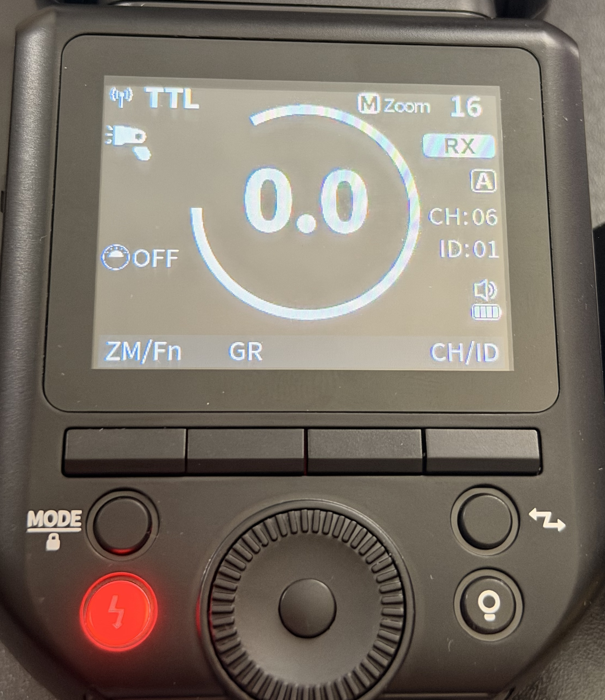
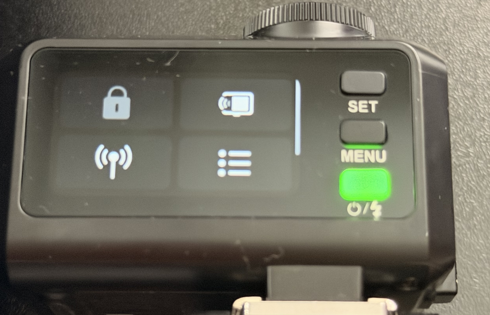
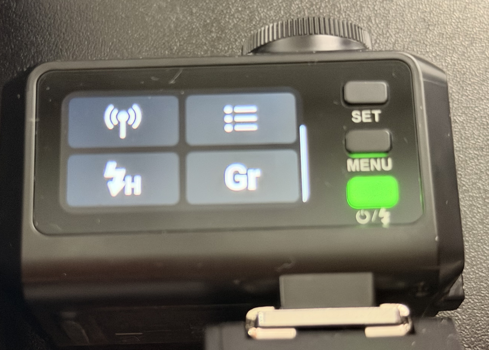
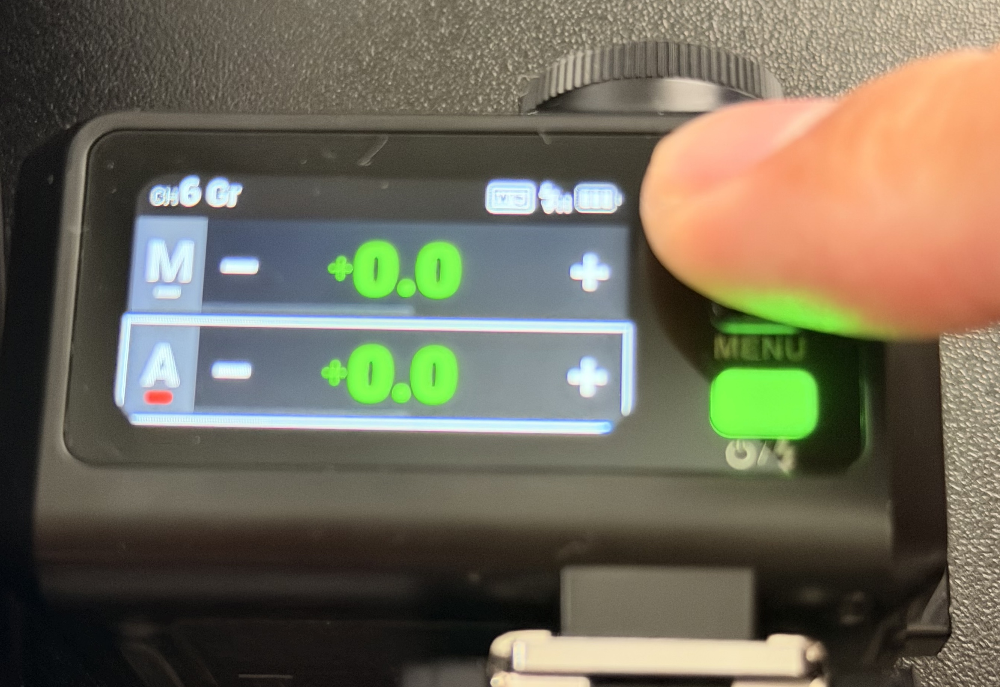

# Sync Godox IT30Pro with Neewer Z2Pro (fujifilm)

[Here's the video tutorial](https://www.youtube.com/watch?v=OiROzpwogb0)

I think for now this only works with the Godox controlling the Neewer, not the other way around.

The first step is to update firmware on both units. For each, you'll need a firmware updater software and the firmware itself. Both can be easily found on the manufacturer's website through a quick Google search.

After that, on Neewer Z2 Pro:
- Press the Zap button (top right of the bottom buttons). Use main dial to turn to "RX" mode (receiver), press the power button (inside the main dial) to select and return to menu. Now it's in receiver mode.
- Long press ZM/Fn button to enter menu. Use dial again to find "RX Compat", press Power button to enter edit, turn dial to change it to "On". Now it's compatible and can talk to Godox.
- Still in Menu, search for "Scan". Should be "Off" by default, similar to previous step to change it to "Start", then press Power button again to enter scanning. Now it'll scan for free channel. Wait a bit and it'll show a list of channel. Choose 1. Press ZM/Fn button again to go back out.

On the front display, it now shows something like this:

In this example, it shows Neewer Z2Pro F is in Receiver mode (RX), Group A, Channel 6, and ID 01. You can change Group, Channel, and ID via pressing "GR" and "CH/ID" buttons.

Now the Neewer is ready, let's head to the Godox. First change the Godox to Transmitter mode (top right button seen in below image). Then click on the antenna signal icon (bottom left), change to the same group and channel as in the Neewer (in this example, 6 and 1), then click on sync.

It will show a display saying something like "Please confirm wireless sync on the receiver", but the Neewer flash won't show anything, but it will sync. Wait a bit then press menu to return to menu.

Swipe down to access control menu again, change mode to group ("Gr"). Swipe up, now you'll see menu listing all groups it's controlling. The first one is the Godox itself. Remember that our Neewer is in group A, it might be off by default. Use the dial to move to that group, then long press "Set" button to turn it On/Off. In this case we want to turn on group A. Now you can control Neewer flash. You can also turn off the first group so the godox only works as a trigger.

